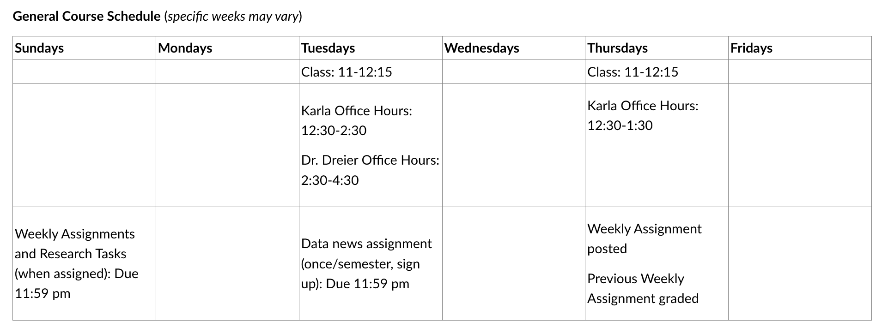

## Who am I?

::: {.columns}
::: {.column width="60%"}
**Assistant Professor Sarah Dreier:** Instructor & researcher at UNM \
**Research:** Politics around the world, democracy, state oppression, gender, and human rights — across East Africa, the US, and the UK and Ireland \
**In the news:** Co-PI on a $152M NSF/NVIDIA grant to build a national open AI ecosystem, leading data curation for the Allen Institute for AI. [Read more →](https://news.unm.edu/news/political-science-professor-joins-grant-funded-project-to-advance-ai-research) \
**Educational background:** Ph.D. at University of Washington, Public Policy in D.C.
:::

::: {.column width="40%"}

:::
:::

::: {.notes}
Research locations: Kenya, Ethiopia, Uganda, Tanzania, United Kingdom, Ireland, United States.
Research topics: gender, queer inclusion, church-state politics, government oppression and rights violations, due-process violations, racism in the media.
Research methods: interviews, archival research, ethnographic observation, statistical analysis, and the use (and limits) of NLP/AI in studying politics.
:::

---

## Instructor roles

**My role:** Lectures, course discussions, and course activities to guide you through the course concepts and skills.

**Your TAs' roles:** Your guides in navigating this course, understanding concepts, and troubleshooting R.

Meet Karla (and Lindsey on Thursday)!

---

<!--#s make headings; the more hashtags/pound signs in a row, the smaller the heading. Note that it doesn't work without a space in between the hashtag and the text. -->

### Course Objectives

  - Understand the fundamental components of **social science research**
  - **Gain experience** interpreting statistical and experimental evidence
  - Implement basic **statistical analysis** in **R**
  - **Think critically** about how data and empirical analysis can reinforce or challenge the unearned dominance of some social groups over others
<!--# to make words bold, wrap in double asterisks like **this** -->

<!--# use dashes (-) to make bullet points; indents indicate sub bullet levels -->

<!--# Note: some of the list items in the original presentation ended in semicolons. You can't do this in Quarto because it will interpret that as you wanting the list items to be part of the same paragraph. -->

<!--# If you want two sentences or phrases to show up as separate lines, you must skip a line in between them, except subbullets. If you just type them on lines next to each other without skipping one, they will show as part of the same paragraph. -->

::: {.notes}
Full objective: think critically about how data, evidence, and empirical analysis can reinforce or challenge the unearned dominance of certain social groups over other minoritized groups — e.g., how does political power influence/skew research conclusions?
:::

---

### Career Opportunities

Tangible skills that can help advance your major, honors degree, grad school pursuits, and career.

> *"When I updated my resume recently, I made sure to include our Political Analysis class—and it really paid off. I was just hired as a Regional Political Director for [XXX]'s campaign for Governor, and I truly believe that highlighting the experience and skills I gained from your course helped set me apart... Thank you for everything you taught us."*

::: {.notes}
Speaker notes go here.
:::

<!--
## Anonymous Course Reflection

1. Name one thing you have heard about this class.

2. Name one thing that excites you about taking this class.

3. Name one concern you have about taking this class.

::: {.notes}
Speaker notes go here.
:::
-->

---

## What will you do in this course?

### Develop, execute, and report on a statistical analysis, using an existing observational survey dataset and a survey experiment.

You will use a real-world survey dataset (of American voters or of citizens in countries from around the world) and conduct an analysis to evaluate if and to what extent one thing (as reported by the survey respondents) is associated with another thing (as reported by the survey respondents). You will also work in groups to conduct a survey experiment of your political science peers.

**Weekly tasks:**

  - Assigned readings, in-class reading responses and activities
  - Weekly assignments
  - Research Analysis tasks

## {background-color="#1a1a1a"}

  **What is the political issue that most directly impacts your life and why?**

  

  What is one political topic you are particularly interested in, and why?
  

::: {.notes}
Speaker notes go here.
:::

---

## What is required of you? {.smaller}

1. **Course Participation & Activities (30%):** Reading responses, reflections, and in-class activities

   > *Note about attendance:* We anticipate that many students will miss a few classes throughout the semester (due to illness, family circumstances, other responsibilities, etc.). Accordingly, you will get three "freebie" days in which you will not be penalized for missing class or neglecting to complete the course readings. Every class builds from the previous, so we strongly encourage you to catch up from missed material when you can. To allow for this, course activities will be posted on Canvas after class. However, **you will not be given credit for completing in-class activities online or outside of class.** You are welcome to notify us if you are experiencing an unexpected life circumstance that prevents you from attending multiple class periods, particularly in a row, as this may impact your ability to successfully complete the course.

2. **Weekly Assignments (20%):** Short homework, due **every Sunday**
3. **Data News Project (10%):** One news article — selection, analysis, and in-class presentation
4. **Midterm Exam (20%):** In-class; can raise your score by one letter grade
5. **Final Research Analysis (20%):** Observational + experimental analysis, built up over 5 guided tasks

::: {.text-center}
*Life happens. Talk to us if you're encountering barriers to meeting course expectations.*
:::

::: {.notes}
1. Course Participation & Activities (30%): each class period includes some form of required written participation — reading responses (start of class), course reflections/summaries (end of class), and/or in-class activities, some requiring advance preparation.
2. Weekly Assignments (20%): posted Thursdays, due Sunday evenings on Canvas; practice the week's material and build toward the final research project.
3. Data News Project (10%): once during the semester, select/read/summarize/analyze/present a news article using data or social science research; three Canvas submissions plus an in-class presentation. Lindsey is your point of contact for this.
4. Midterm Exam (20%): covers Weeks 1–7 (research design, data exploration, R coding basics); in-person, hand-written; can raise your score by up to one letter grade. Date: Tue 10/6.
5. Final Research Analysis (20%): an original research hypothesis, tested with an observational dataset (multiple-variable regression) AND an experimental survey (completed in groups); five guided tasks across the semester. Due Wed 12/9. There is no final exam in this course.
:::

---

## What will a typical week look like?

::: {.text-center .larger-text}
Weekly Snapshot
:::

---

## What do you need to succeed in this course?

- **NO PRE-REQUISITES**

- **Textbook:** Kellstedt, Whitten and Tuch. 2023. *The Fundamentals of Social Science Research*, 4th ed.

- **R and Rstudio:** download R on a personal computer or on a UNM rental

- Access to **Canvas:**

    - Required course readings (PDFs)
    - Announcements and changes to the syllabus
    - Portal to download and submit course assignments

- **SYLLABUS,** updated each Thursday: [https://skdreier.github.io/POLS2140/#course-schedule](https://skdreier.github.io/POLS2140/#course-schedule)
- Paper notebook and writing utensil every day

- Willingness to ask questions and make mistakes!

::: {.notes}
Speaker notes go here.
:::

---

## Course Readings and Assignments

- Always finish the assigned readings before class that day

- Textbook will be on course reserve at Zimmerman Library

- Assignments are always due at 11:59 pm on Canvas on the assigned day

::: {.notes}
Speaker notes go here.
:::

---

## Course Rules and Guidelines

- **No** phones/laptops/tablets in class (except during R coding & defined activities)
- **Use Canvas** for assignments, announcements, readings, slides, and R scripts — **not** for emailing your TAs or Prof. Dreier
- **Attendance:** Contact your TAs only for multiple consecutive missed classes
- **Generative AI:** only for debugging R code you've already worked on, or when the professor explicitly directs it
- **Rely on** class time and office hours (not individual emails) for help

::: {.notes}
Full Canvas note: access announcements, syllabus, readings, datasets, lecture slides, R scripts, and assignment instructions there — but do not use Canvas messaging to email your TAs or Prof. Dreier.
:::

---

### This class is designed to enable student success! Common things that get in the way:

- Regularly missing class
- Falling behind on weekly assignments
- Neglecting to finish research assignment tasks
- Insufficiently reading and following assignment instructions

---

## Pop Quiz!

**In your opinion, what is the most important thing you learned about this course today?**

::: {.fragment}
**What do you think Dr. Dreier thinks is the most important "take-away" about the course introductions?**
:::

::: {.notes}
Speaker notes go here.
:::

---

## Wrap up

::: {.incremental}
- For Thursday: One reading. What is it, and how do you know?
- Canvas Orientation
- Survey: Tell us about you!
  - **Introductions:** Name, how long you have been at UNM, one political topic that is important to you.
  - **Stats:** Have you taken any statistics courses before? Used R?
  - **Office Hours:** Do you have conflicts that prevent you from attending any window of our office hours (Karla: Th 12:30--2:30; me: Tue 2:30--4:30)?
  - **Circumstances (optional):** I invite you to clarify your pronouns and/or to share any unique circumstances that you feel may impact your performance in this course (e.g., jobs, family responsibilities, sports, learning styles, access to course materials, languages, etc.) – totally optional!
:::

