## Announcements

- **Local internship workshop**: Wed Aug 26, 3:00-4:00 pm at Social Sciences 2060

- **Political Science open house**: Wed Aug 26, 4:00-5:30 pm at Social Sciences Floor 2

- Sign up for your Data News presentation (by Fri Aug 28) via Canvas Pages!

::: {.notes}
Speaker notes go here.
:::

---

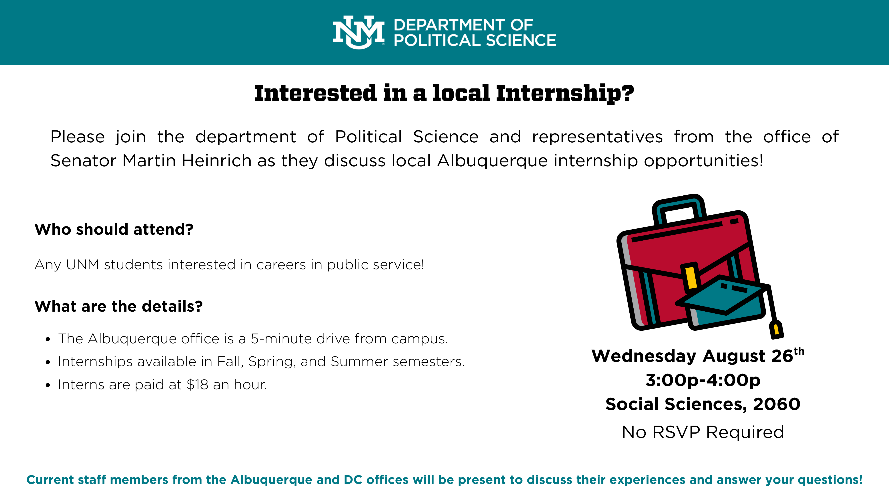

::: {.notes}
Speaker notes go here.
:::

<!--

---

## Wrap up from last class

-->

---

## Reading Prompt

What is one "rule of the road" the chapter discussed? In your own words, why is it important for the practice of political science?

::: {.fragment}
What does it mean to approach understanding politics as a *scientific* exercise?
:::

<!--
**Option A — Paradigm shift:** Chapter 1 uses the 16th-century example of astronomers abandoning the idea that the Earth was the center of the universe to introduce the term "paradigm shift." In your own words: what is a paradigm shift — and why does the book say political scientists actually *disagree* about whether their own field has ever had one?

. . .

**Option B — Erie County, Ohio:** Chapter 1 opens its discussion of scientific knowledge with a team of Columbia University researchers who studied public opinion in Erie County, Ohio during the 1944 presidential election. What were they trying to find out?

. . .

**Option C — The "boring EU course":** Chapter 1 contrasts a "just-the-facts" course (e.g., the EU had 15 members in 1995, 28 in 2016) with a more scientific approach. Why does the book argue that a scientific approach is more interesting/desirable than the just-the-facts one?
-->
---

## Sarah-to-Sarah Notes {visibility="hidden"}

<!-- When these issues are resolved, you can delete this slide. -->

Content: I had trouble updating the LGBTQ+ elected officials slide for a couple of reasons that I wanted to talk to you about. One of the stats you found before I'm having trouble finding an update to and I wondered if you remembered where you found it. Then, I found the updated stats on the new Victory Project very confusing. This is probably related to me not being up-to-date on exactly how gender identifications are recorded/quantified/categorized, but I feel like there were some statements about the numbers of certain types of LGBTQ+ elected officials that can't be true at once? I was having a hard time getting a reliable count and I hoped you could help.

Technical: This slide mixes R language and HTML language more than I'd like. This is because I initially wanted to stay mainly with R language throughout and I've learned that it will probably be better/easier/more efficient to mostly use HTML language for formatting/design/layout stuff. I will try to use more consistent language in the future and I can go back and clean up if you want.

<!-- Commented out — uncomment to restore these two slides.

::: {style="text-align: center; font-size: 125%;"}
What is one thing that you KNOW to be true?

HOW/WHY do you know that it is true?
:::

::: {.notes}
Speaker notes go here.
:::

---

## Ways of "knowing"

- Learn things directly ourselves
- Accept what trusted authority says is true
- Knowledge from cultural or religious traditions
- Intuition or common sense
- **Scientific method**
- Others?

::: {.fragment}
Ideas and observations about *political* phenomena are inevitably shaped by social context and perspective. Still, the scientific method offers **the most pragmatic approach** to understanding today's pressing political problems.
:::

::: {.notes}
Speaker notes go here.
:::

-->

---

## What is political science?

::: {style="text-align: center;"}
The scientific study of **political phenomena.**
:::
. . .

<!--# To make text a different color, use HTML like shown above. -->

### Political phenomena:

::: {.incremental}
1. People's **political behavior**: votes, tweets, campaign promises, political attitudes, protesting, etc.
2. **Government power**, including to write/enforce laws and policies, detain/restrict behavior, use violence.
3. **Who governs whom** (and how that impacts those who are governed).
4. **Distribution of legitimacy and resources**.
4. **Interactions between/within political state boundaries** — how states relate to one another, and how individuals relate to political institutions.
:::

::: {.notes}
Speaker notes go here.
:::

---

## JOT DOWN specific examples of:

1. Your own **political behavior** (voting, protests, blog posts, etc.).
2. A time when you (or someone close to you) experienced **government power**.
3. How someone or something **"governs"** your behavior.
4. How you were impacted by how resources are distributed or how identities are (de)legitimized
4. A time **states and/or countries interacted with one another** in a way that affected your life.

::: {.notes}
Speaker notes go here.
:::

---

## What is political science?

::: {style="text-align: center;"}
The **scientific study** of political phenomena.
:::

::: {.incremental}
- Exploring and testing the relationships between observable "variables."
- With one variable, I can describe something going on in the world.
:::

::: {.notes}
Speaker notes go here.
:::

---

:::: {layout="[45,55]"}

::: {#first-column}

**Describe** a circumstance:

::: {.incremental}
- In 2024, about 27% of national parliamentarians are women. [@ipu2024women]
- 25.1% of countries for which 2024 data is available have 1/3 or more of their parliamentary seats held by women. [@worldbank2024parliament]
- What observations can you make with this information?
- What questions does this information spark for you?
:::

:::

::: {#second-column}

Proportion of Seats Held by Women in National Parliaments Over Time (%)

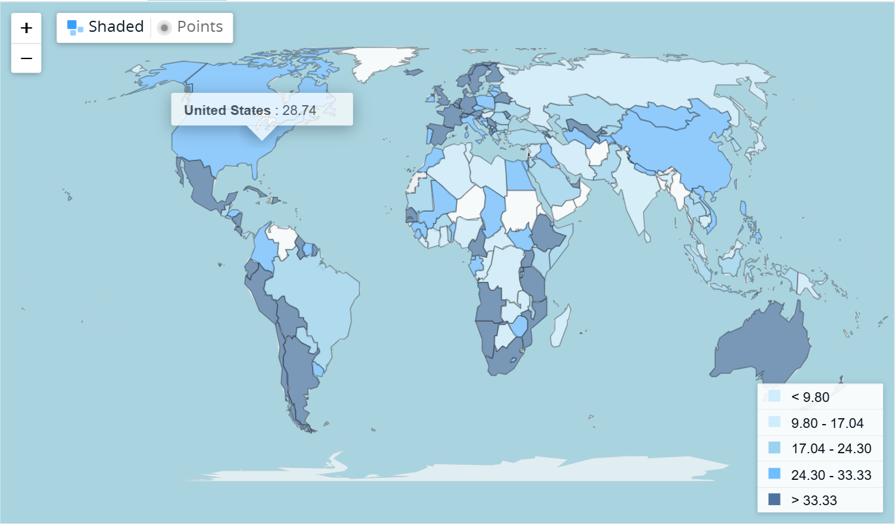

Source: World Bank Group

:::

::::

::: {.notes}
Speaker notes go here.
:::

---

## The stats: National parliamentarians {.smaller}

<!--# The fragmenting language makes this part of the slide show up separately after the first (for more complicated fragmenting, you can specify orders or make a bulletted list show up as a list of fragments) -->

:::: {.grid layout="[1,2]"}

::: {.grid-item}

Today: Only 27% of parliamentarians are women [@ipu2024women]

::: {.fragment fragment-index=1 .fade-in}
Some variation across continents.

No clear association between a country's wealth and representation.
:::
:::

::: {.grid-item .fragment fragment-index=1 .fade-in}
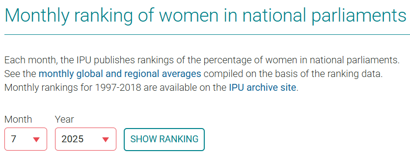
:::

::::

:::: {.grid}

::: {.grid-item span-col=2 .fragment fragment-index=2 .fade-in}

Proportion of Seats Held by Women in National Parliaments by Region (%)

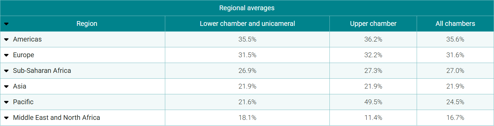

Source: IPU Parline

:::

::::

::: {.notes}
Speaker notes go here.
:::

---

## UPDATE: Women in National Parliaments (2026)

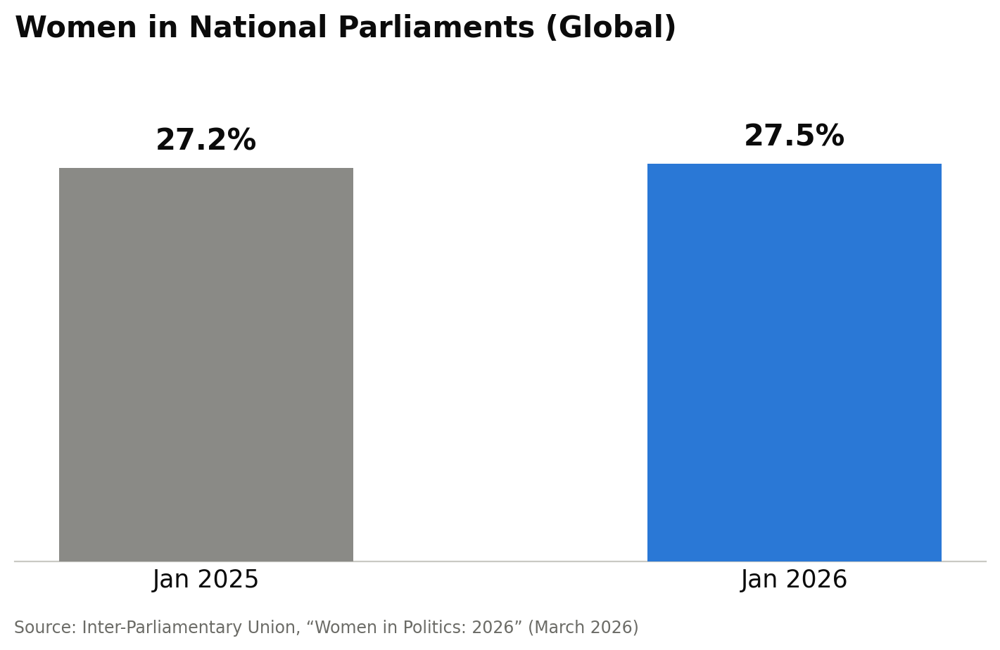

- Growth has slowed to its lowest rate since 2017 — at this pace, global gender parity is roughly 75 years away
- The Americas remain the highest-representation region, at 35.6%

::: {.notes}
2026 IPU update: 27.5% globally as of Jan 1, 2026, up from 27.2% a year earlier — a 0.3-point gain, matching 2024's rate as the slowest since 2017. Regional breakdown and speaker/committee-chair trends are also in the source report if useful for discussion.
:::

[@ipu2026women]

---

## The stats: LGBTQ+ elected officials {.smaller}

:::: {.grid}

::: {.grid-item span-col=2}

- Between 1977–2015, a known transgender candidate has been elected to office 72 times worldwide.
<!-- Note Sarah B to Sarah D: Do you remember where you found the info above? I'm having trouble finding this. -->
- In the U.S. today, 39 elected officials identify as nonbinary, genderqueer, and/or transgender [@victory2025out]

:::

::::

:::: {.grid layout="[63, 37]"}

::: {.grid-item style="font-size: 0.75em;"}
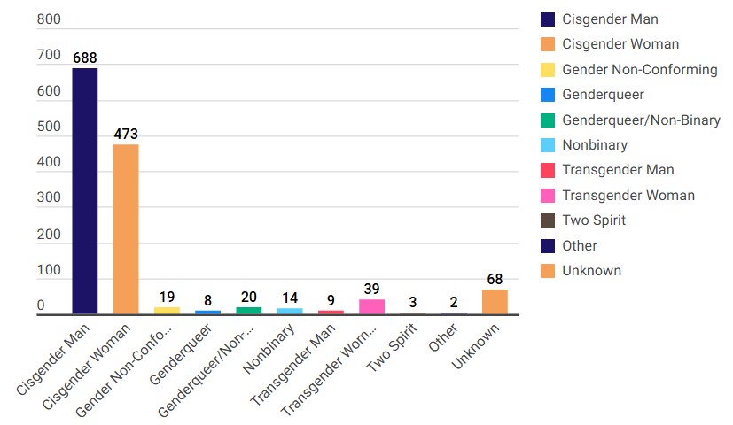{style="max-height: 32vh; width: auto;"}
:::

::: {.grid-item style="font-size: 0.75em;"}
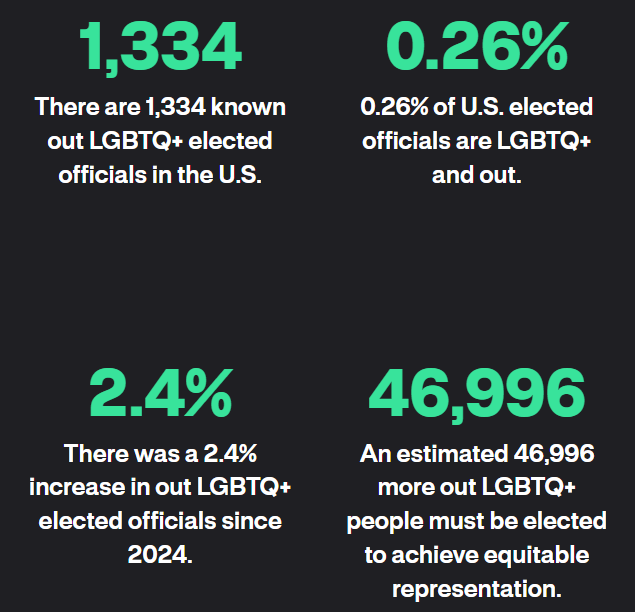{style="max-height: 32vh; width: auto;"}
:::

::::

::: {.notes}
Speaker notes go here.
:::

---

## UPDATE: LGBTQ+ Elected Officials (2026)

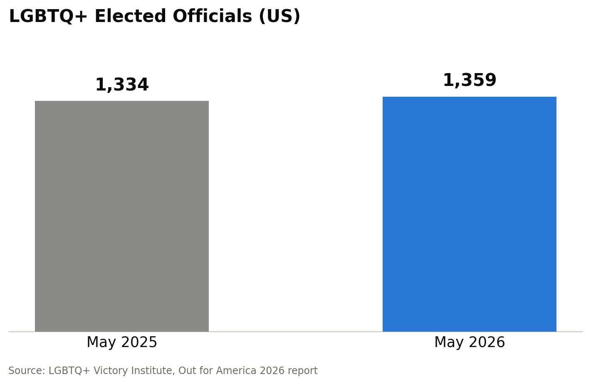

- Up from 1,334 the prior year — modest continued growth
- Some researchers argue this report still **undercounts** LGBTQ+ officials, particularly in California — worth remembering as we discuss how data is never fully "raw" or neutral

::: {.notes}
Ties back nicely to the Barrowman "Why Data is Never Raw" reading and the Week 3 Data Feminism unit — even a well-intentioned census like this one has known measurement gaps.
:::

[@victory2026out]

---

## The stats: Heads of state

  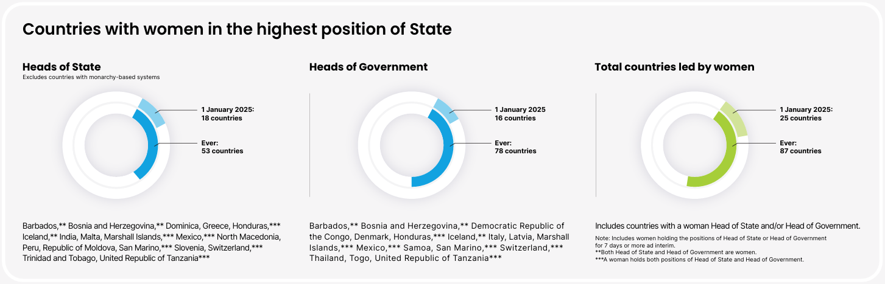
  
Source: UN Women

::: {.notes}
Speaker notes go here.
:::

---

## The stats: Heads of state {.smaller}

- 60 UN member states (31%) have had women heads of state [@pew2024womenleaders]

:::: {.grid layout="[59, 41]"}

::: {.grid-item}
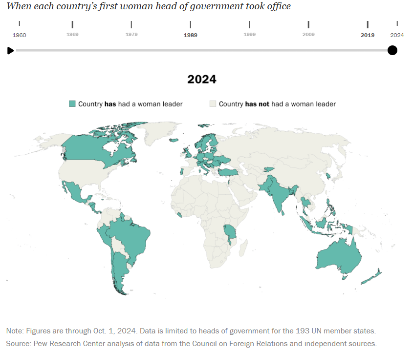
:::

::: {.grid-item}
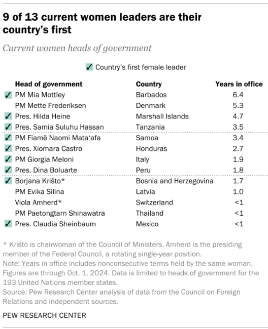
:::

::::

::: {.notes}
Speaker notes go here.
:::

---

## UPDATE: Women Heads of State (2026)

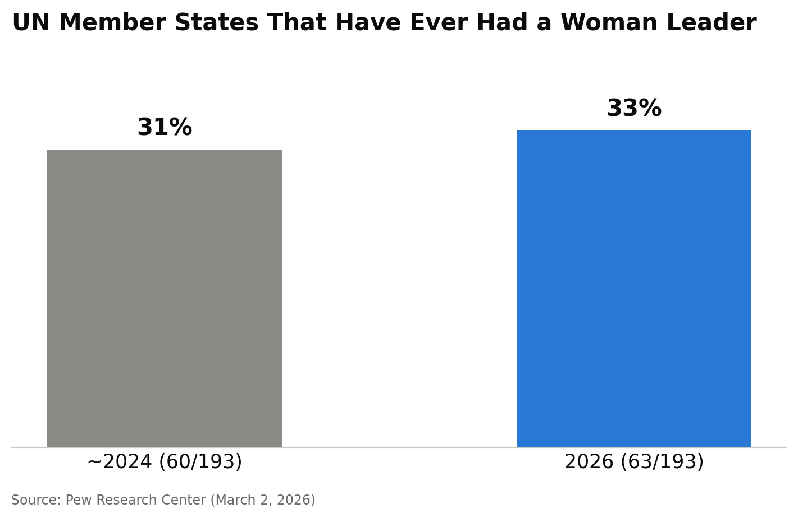

- 63 of 193 UN member states have now *ever* had a woman leader — up from 60
- For comparison: as of January 2026, only 28 countries are **currently** led by a woman — just 1 in 7 worldwide

::: {.notes}
Good spot to distinguish two different metrics: cumulative ("ever had") vs. current snapshot. The "currently led" figure is a different, smaller number than "ever had" — useful for discussing how the same underlying reality can be described very differently depending on which statistic you choose to report.
:::

[@pew2026womenleaders]

---

## Resources and interactive data portals {.smaller}

- **UN Women** — [Women's leadership and political participation](https://www.unwomen.org/en/what-we-do/leadership-and-political-participation/facts-and-figures) (facts, figures, and infographic)
- **IPU Parline** — [Global data on women in national parliaments](https://data.ipu.org/women-ranking/)
- **World Bank Data** — [Proportion of seats held by women in national parliaments](https://data.worldbank.org/indicator/SG.GEN.PARL.ZS)
- **Pew Research Center** — [Women heads of state](https://www.pewresearch.org/short-reads/2024/10/03/women-leaders-around-the-world/)
- **LGBTQ+ Victory Institute** — [LGBTQ+ U.S. elected officials (2024)](https://victoryinstitute.org/out-for-america-2024/)

::: {.notes}
Speaker notes go here.
:::

---

## What is political science?

::: {style="text-align: center;"}
The **scientific study** of political phenomena.
:::

::: {.incremental}
- Exploring and testing the relationships between observable "variables."
- **With one variable,** I can describe something going on in the world.
- **With two variables,** I can begin to explain <strong>why</strong> that thing is the way it is: causation.
:::

::: {.text-center .fragment}
Beginning to capture causation can help us understand how things come about and what social or policy changes could lead to **new** outcomes.
:::

<!--# Simplified from the original hand-drawn SVG arrow (which depended on present_style1.css's pixel-positioned .arrow-svg/.arrow-label classes) to a plain fragment reveal — same "reveal the answer" effect, no custom CSS dependency. -->

::: {.notes}
Speaker notes go here.
:::

---

:::: {layout="[42,58]"}

::: {#first-column}

::: {.fragment}
How does this new information shift your original observations?
:::

::: {.fragment}
Does this mean that an increase in **time causes** an increase in **women's representation?**
:::

::: {.fragment}
Or is there something else that maybe also increases with time that is the real cause of women's representation?
:::

:::

::: {#second-column style="text-align: center;"}

Proportion of Seats Held by Women in National Parliaments Over Time (%)

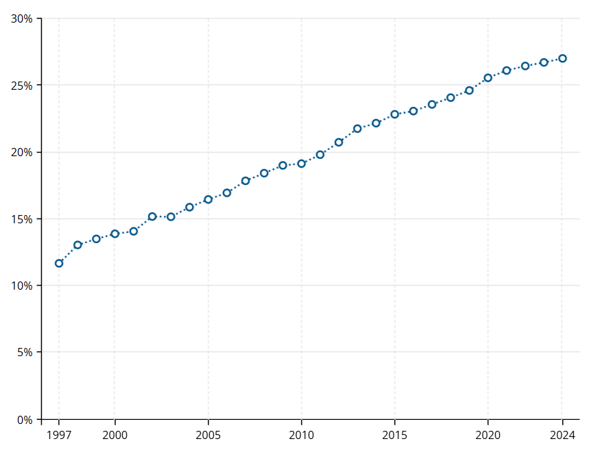

Source: World Bank Group

:::

::::

::: {.notes}
Speaker notes go here.
:::

---

## What is political science?

::: {style="text-align: center;"}
The **scientific study** of political phenomena.
:::

::: {.incremental}
- Exploring and testing the relationships between observable **"variables."**
- **Dependent Variable (DV, Y)** — the outcome you want to explain; the thing that **depends on** (is influenced by) something else.
- **Independent Variable (IV, X)** — the thing you think influences your DV; in theory the IV should "come before" your DV (reality is not that simple).
:::

::: {.notes}
Speaker notes go here.
:::

---

:::: {layout="[42,58]"}

::: {#first-column}

What kinds of causal relationships might you expect?

::: {.incremental}
- % women as the DV?
- % women as the IV?
:::

:::

::: {#second-column}

Proportion of Seats Held by Women in National Parliaments Over Time (%)

Source: World Bank Group

:::

::::

::: {.notes}
Speaker notes go here.
:::

---

## What is political science?

::: {style="text-align: center;"}
The **scientific study** of political phenomena.
:::

::: {.incremental}
- Exploring and testing the **relationships** between observable **"variables."**
- **Dependent Variable (DV, Y)** — the outcome you want to explain; the thing that **depends on** (is influenced by) something else.
- **Independent Variable (IV, X)** — the thing you think influences your DV; in theory the IV should "come before" your DV.
- **Hypothesis** — your guess about the relationship between IV and DV: if X happens, then Y will follow; if we see an increase in X, we should see an (increase/decrease) in Y.
:::

::: {.notes}
Speaker notes go here.
:::

---

## WEEKLY ASSIGNMENT (due this Sunday)

- What are 2–3 political outcomes (**dependent variables**) that matter to you?
- For one of these topics, what is one thing (**independent variable**) that helps explain, shape, or influence your outcome?
- Come up with a guess (a **hypothesis**) about the direction of influence your IV might have on your DV.

::: {.notes}
Example: As **women's education (IV)** in a given country increases, I expect that **women's representation in parliament** will increase.
:::

---

## Tuesday's Reading {.smaller}

:::: {layout="[[1,1],[1]]"}

::: {}
<a href="https://goodauthority.org/" target="_blank">
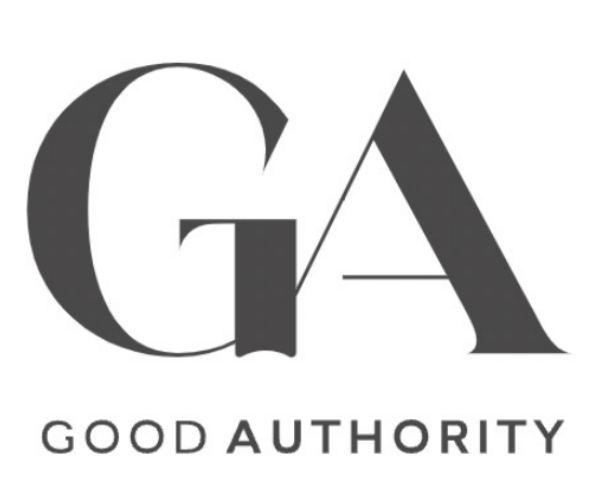
</a>
:::

::: {}

  <a href="https://blogs.lse.ac.uk/" target="_blank">
  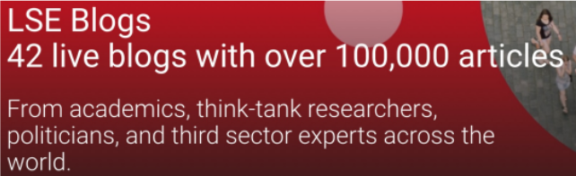
  </a>

:::

::: {}

These are blogs for social scientists to present their research to a public audience. Select and read an article that interests you from <strong><a href="https://goodauthority.org/" target="_blank">Good Authority</a></strong> (most recommended) or an <a href="https://blogs.lse.ac.uk/" target="_blank">LSE blog</a>. Identify the author's IV, DV, and conclusion, and be prepared to discuss in class on Tuesday.

:::

::::

::: {.notes}
Speaker notes go here.
:::

---

## TL;DR

- Political science is the **scientific study of political phenomena** — people's political behavior; government power; who governs whom; allocation of resources and legitimacy; and interactions between states, institutions, and individuals
- With **one variable** you can describe what's happening in the world; with **two variables** (an IV and a DV) you can start to explain *why* — that's the move into causal reasoning
- A **hypothesis** is a testable guess about how your IV influences your DV — the backbone of the research process we'll use all semester
- Real-world data (e.g., women's political representation) shows both progress and persistent inequities — and even good, well-sourced data has limits and undercounts worth interrogating
- **For Tuesday**: read a political science blog post and identify the author's IV, DV, and conclusion

---

## References {.smaller}

::: {#refs}
:::
