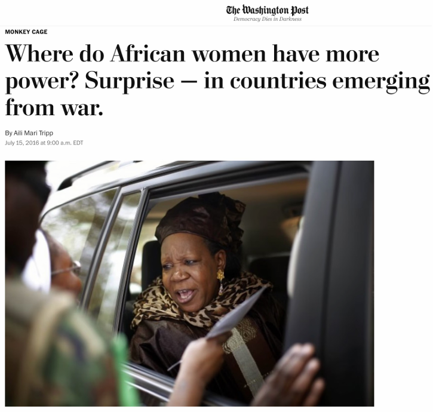

## Reading Prompt

Answer one of the following two questions (as best you can) about the social science post you read for today:

- What was the "thing" that the research highlighted in the article was trying to explain (DV), and what answer did the author reach (IV)?

::: {style="text-align: center; color: #888; margin: 0.01em 0;"}
OR
:::

- In your own words, what was the main argument (point, take-away, idea) of the article?

---

## Announcements

- **Local internship workshop**: Wed Aug 26, 3:00-4:00 pm at Social Sciences 2060

- **Political Science open house**: Wed Aug 26, 4:00-5:30 pm at Social Sciences Floor 2

- **Sign up** for your Data News presentation (by Fri Aug 28) via Canvas Pages!

- **Office Hours cancelled today** (email for an appointment this week) 

::: {.notes}
Speaker notes go here.
:::

---

::: {.notes}
Speaker notes go here.
:::

---

::: {.notes}
Speaker notes go here.
:::

---

## AI use in this course

::: {.incremental}
- What are the specific ways in which your roommate or best friend use AI in their courses?
- Why do you go to lift weights at the gym?
- If you are here to strengthen your knowledge and critical thinking skills:
  - What do you think are the productive ways to use AI?
  - What do you think are the distracting or deleterious ways to use AI?
- What concerns, questions, or anxieties do you have about AI for your university/career experience?
:::

---

## AI course policy

**Note about using generative AI tools:** You may use Generative AI tools (e.g., ChatGPT) to help adapt and de-bug your R code. You may use AI tools for coding assistance and when explicitly directed by the professor in course activities and assignments. Beyond those cases, you should **not** rely on Generative AI tools to do your research or writing for you, and I recommend that you avoid using these tools altogether. If you do use a generative AI tool for any task beyond coding assistance, you must add a paragraph at the end of your assignment submission (not included in your assignment's length) detailing how you used these tools to aid rather than to replace your own work and learning process. Any use of Generative AI tools (beyond for coding assistance or as directed by the professor) without explaining how you used these tools will be considered cheating/plagiarism and treated accordingly. Your TAs and I reserve the right to decide whether your use is appropriate or constitutes cheating. We also reserve the right to use AI detection software, including screening for AI watermarks, when we suspect AI has been used inappropriately.

# Social Science Building Blocks {background-color="#2c3e50"}

::: {style="text-align: center; font-size: 1.3em; color: #dfe6e9;"}
Identifying IVs, DVs, and Hypotheses
:::

::: {.notes}
Speaker notes go here.
:::

---

## Recap: What is political science?

::: {style="text-align: center;"}
The **scientific study** of political phenomena.
:::

::: {.incremental}
- Exploring and testing the **relationships** between observable **"variables."**
- **Dependent Variable (DV, Y)** — the outcome you want to explain; the thing that **depends on** (is influenced by) something else.
- **Independent Variable (IV, X)** — the thing you think influences your DV; in theory the IV should "come before" your DV (reality is not that simple).
- **Hypothesis** — your guess about the relationship between IV and DV: if X happens, then Y will follow; if we see an increase in X, we should see an (increase/decrease) in Y.
:::

---

## Today's Reading

:::: {layout="[[1,1],[1]]"}

::: {}

:::

::: {}

  

:::

::: {}

These are blogs for social scientists to present their research to a public audience. Select and read an article that interests you from <strong><a href="https://goodauthority.org/" target="_blank">Good Authority</a></strong> (most recommended) or an <a href="https://blogs.lse.ac.uk/" target="_blank">LSE blog</a>. Identify the author's IV, DV, and conclusion, and be prepared to discuss in class on Tuesday.

:::

::::

::: {.notes}
Speaker notes go here.
:::

---

## Description vs. Hypothesis Testing

::: {style="text-align: center;"}
Public-facing social science research articles tend to highlight research that does one of two things:
:::

:::: {.grid layout="[1,1]"}

::: {.grid-item}

**One variable →**

Description

"What's going on?"

:::

::: {.grid-item}

**Two variables (IV + DV) →**

Hypothesis testing

"Why is it going on?"

:::

::::

::: {.notes}
Callback to slide 8/9's "with one variable I can describe... with two variables I can explain why" language — this is the same distinction, just named explicitly now so students have a label for it before they try it themselves.
:::

---

## Case Study: Women's Representation in Africa

:::: {layout="[45,55]"}

::: {#first-column}

Read the article (Canvas Modules)

:::

::: {#second-column}

::: {.incremental}
- Is this Description or hypothesis testing?
- What is the researcher's **DV**?
- What is the researcher's **IV**?
- What **data** did the researcher use to measure her variables?
- How would you summarize the researcher's **hypothesis**?
- Did the researcher prove, disprove, challenge, or advance their hypothesis? Are there caveats or qualifications to their conclusions?
:::

:::

::::

::: {.notes}
Speaker notes go here.
:::

---

## Case Study: Women's Representation in Africa

::: {.incremental}
- **Two variables → hypothesis testing.**
- **DV:** Women's political representation — parliamentary seats, plus legislative/constitutional reforms
- **IV:** Whether a country experienced major armed conflict (civil war)
- **Data:** Cross-national comparison of post-conflict vs. non-conflict African countries' representation rates over time
- **Hypothesis:** Conflict disrupts existing gender roles, which opens space for women's political mobilization afterward.
- **Discussion:** How / In what ways did conflict disrupt existing gender roles (**mechanisms**)?
:::

::: {.notes}
Tripp et al.'s research (referenced in the Monkey Cage piece): post-conflict countries show significantly higher rates of women's political representation than countries that haven't experienced major conflict, and have passed more legislative/constitutional reforms on women's rights. Point out to students that the "data" here isn't one dramatic anecdote — it's a systematic comparison across many countries over time.
:::

---

## In class exercise: Understanding your selected research article

::: {.incremental}

**For the article you selected:**

- Was this article involved with **description** or **hypothesis testing**?
- What was the researcher's **descriptive** or **dependent variable (DV)**
- What was the researcher's **independent variable (IV)** (if hypothesis testing)
- What was the researcher's **hypothesis**?
- What **data** did the researcher use to measure their variable(s)?
- Did the researcher prove, disprove, challenge, or advance their hypothesis? Any caveats?
- What are the **implications** of this research? Why does it matter?
:::

<!--# Simplified from the original hand-drawn SVG arrow (which depended on present_style1.css's pixel-positioned .arrow-svg/.arrow-label classes) to a plain fragment reveal — same "call out the hint" effect, no custom CSS dependency. -->

::: {.notes}
DV: the outcome you want to explain — the thing that depends on (is influenced by) something else.
IV: the thing you think influences the DV; in theory the IV should "come before" the DV (reality is not that simple).
Hypothesis: their guess about the relationship between IV and DV — e.g., if X happens, then Y will follow; if we see an increase in X, we should see an increase/decrease in Y.
:::

---

## Small-group exercise

::: {.incremental}
- Groups of 2–3
- Each group picks a **different** article from <a href="https://goodauthority.org/" target="_blank">Good Authority</a>
- ~10 minutes: work through identifying the same components: Description or hypothesis testing; DV and IV; data; hypothesis; conclusions; implications.
- Report back! 
- Probing questions: 
  - What constituted the "data" — was it survey data, a natural experiment, historical records, something else?
  - Was anyone's article surprising, unclear, or hard to classify, etc.?
:::

---

## Thursday preview

Human judgment is involved at every stage of the research development and analysis pipeline!

