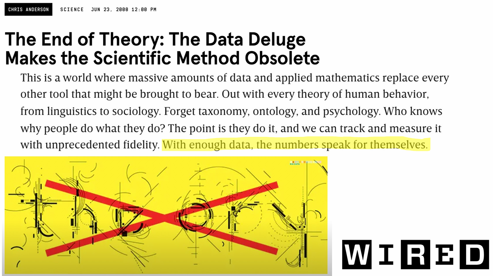
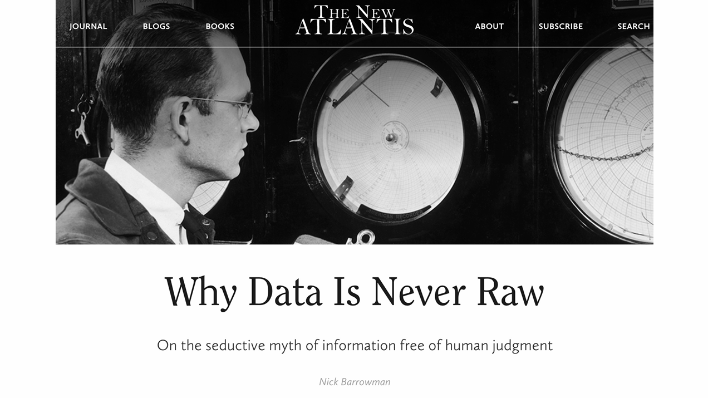
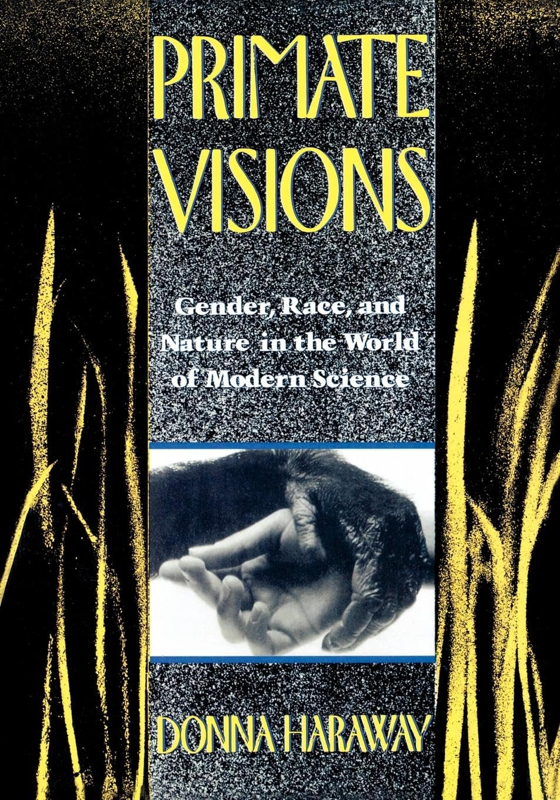
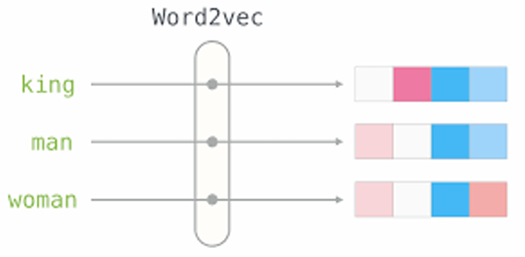
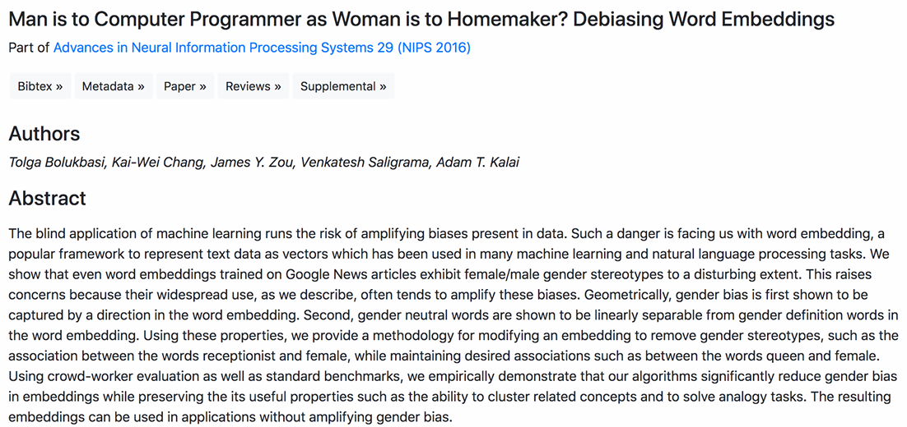
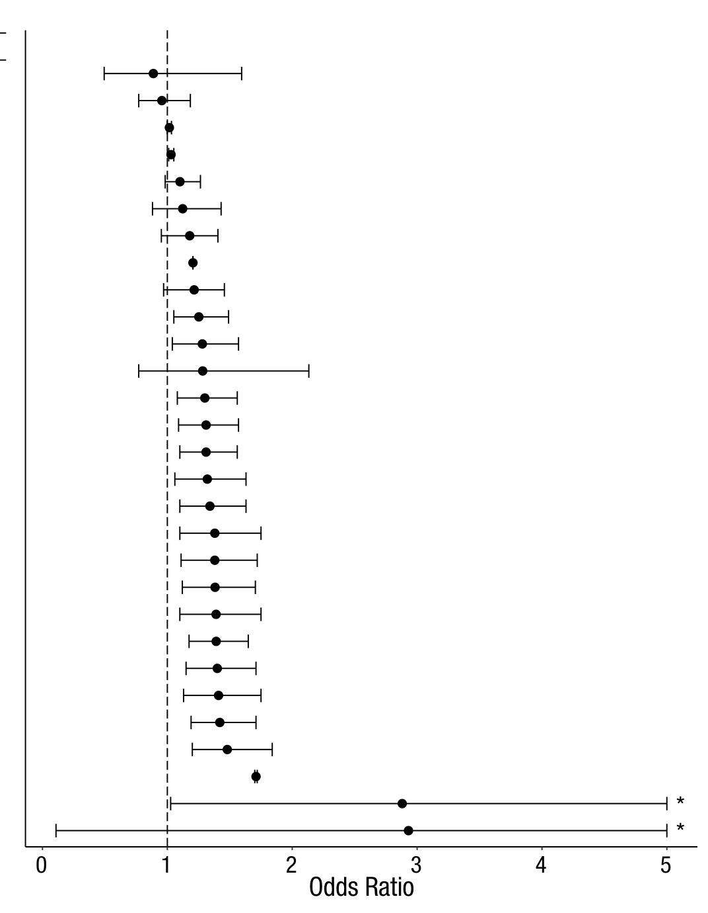
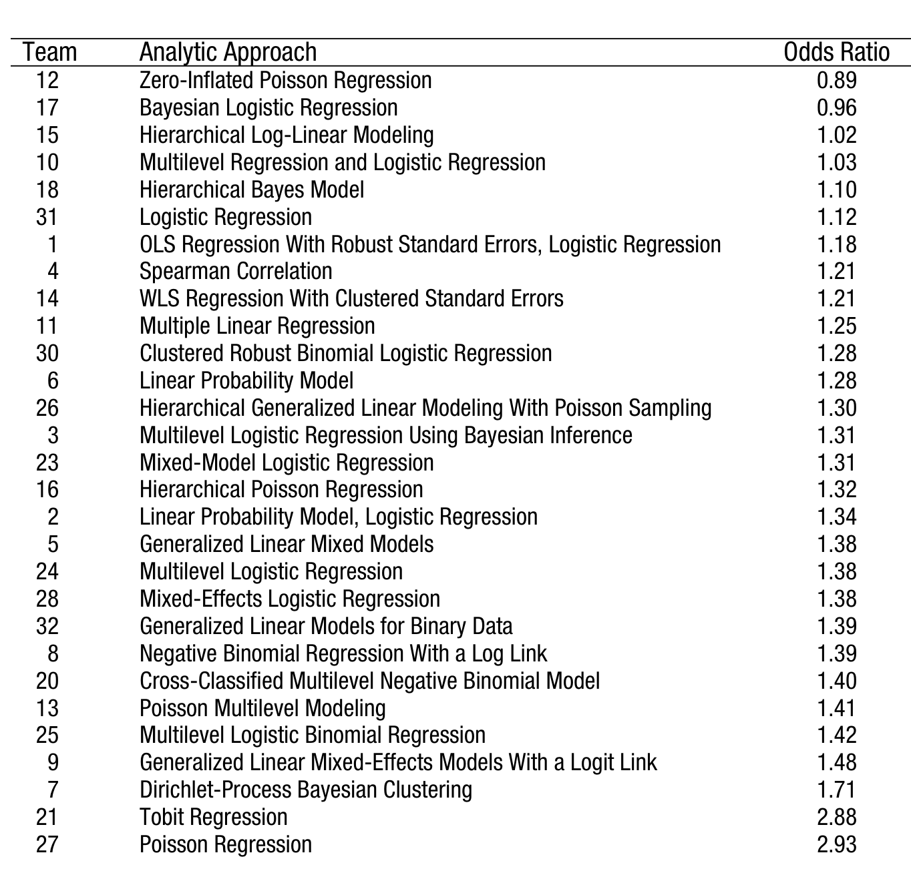
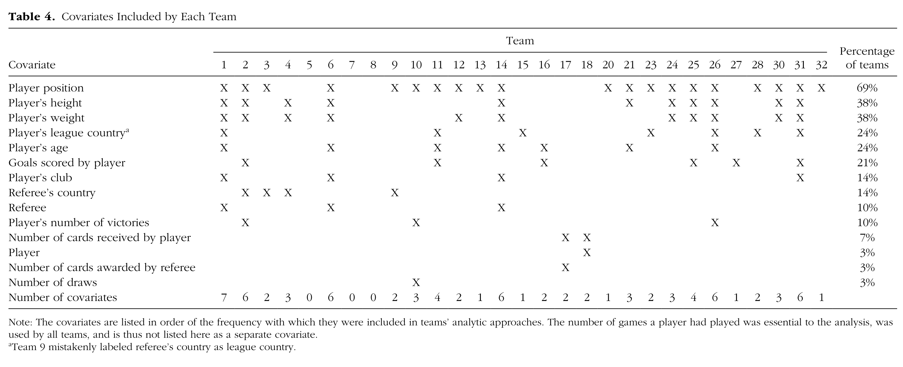

## Reading Prompt

In the Silberzahn et. al. article, "Many Analysts, One Dataset," what was the *substantive* research question the research teams were answering? What was one thing you learned about how human judgment shapes statistical outcomes (just try your best to answer this question!)?

---

## Announcements

- **Data News sign-up:** 6 outstanding; we will assign for you on Saturday.
- **Weekly Assignment** posted today!

::: {.notes}
Speaker notes go here.
:::

---

## Data News Presentations

- **Kennedy Brown** — <a href="https://www.pewresearch.org/short-reads/2025/06/30/dissatisfaction-with-democracy-remains-widespread-in-many-nations/" target="_blank">Dissatisfaction with Democracy Remains Widespread in Many Nations</a> (Pew Research Center)
- **Zuriel Castillo** — <a href="https://www.nytimes.com/2025/12/05/well/ai-chatbots-political-opinions-study.html" target="_blank">AI Chatbots Political Opinions Study</a> (*New York Times*)

# What is Data? {background-color="#2c3e50"}

---

::: {style="text-align: center;"}
What is **data?**

::: {.fragment}
What are some examples of data used to study **politics** and/or the **social world?**
:::

::: {.fragment}
What data did the research in your blog post (from Tuesday) use? Did the researchers generate the data themselves or adopt it from somewhere else?
:::

::: {.fragment}
What data did the researchers in the Silberzahn article use?
:::

::: {.fragment}
Data represents how we **measure concepts of interest.**
:::

:::

::: {.notes}
Speaker notes go here.
:::

---

::: {.notes}
Speaker notes go here.
:::

---

::: {.notes}
Speaker notes go here.
:::

# All analyses involve human judgements {background-color="#2c3e50"}

---

## All analyses involve (hopefully reasonable!) human judgements / decisions

Human judgement is involved at every stage of the research pipeline, including:

::: {.incremental}
- The **questions** we ask...
- How we **produce** the data
- How we **analyze** the data
:::
---

## The **questions** we ask

::: {.notes}
Speaker notes go here.
:::

---

## How we **produce** the data...

> "The context of data — why it was collected, how it was collected, and how it was transformed — is always relevant. There is, then, no such thing as context-free data..." (<a href="https://www.thenewatlantis.com/publications/why-data-is-never-raw" target="_blank">Barrowman</a>)

. . .

**Some (of many) questions to ask about our data:**

::: {.incremental}
- Are we measuring what we think we're measuring?
- Would reasonable people approach the task differently and defensibly?  
- Would different approaches to measuring a given concept give us a different result?
- Do people have incentives to lie, distort, hide, or refuse to answer?
- Who is excluded/under-represented?
:::

::: {.notes}
More questions to raise if time allows: How does our choice of language shape our outcomes? Did people make mistakes entering the data? Do the researcher's incentives or perspectives shape how data is gathered/recorded?
:::

---

::: {style="text-align: center; font-size: 0.85em;"}

Our lived experiences shape how we approach our data.

::: {.fragment}
"But experts and non-experts alike encounter the world not merely through sense experiences but **through frameworks of understanding shaped by numerous factors including theories, values, norms, and faith.** It may be tempting to suppose that this context can simply be set aside. But assumptions, when not made explicit, do not simply cease to exist. Rather, they influence the direction of inquiry, the choice of measurements, the way the data is collected and transformed, and the conclusions that are drawn."
:::
:::

::: {.notes}
Speaker notes go here.
:::

---

## Ex from Natural Language Processing: Human bias in "pretraining" data {.smaller}

::: {.fragment}
**Large Language Models** are used to **classify, predict,** or **generate** large amounts of text (e.g., predicting what question you'll google, or **generating** text via ChatGPT).
:::

::: {.fragment}
LLMs are **"pretrained"** on huge swaths of human-written text. The biases reflected in these texts get baked into the language models.
:::

. . .

:::: {layout="[35, 65]"}

::: {#first-column .fragment fragment-index=1 .fade-in}

::: {style="text-align: center; font-weight: bold;"}
Human judgement?
:::
:::

::: {#second-column .fragment fragment-index=1 .fade-in}

:::

::::

::: {.notes}
Speaker notes go here.
:::

---

## How we **analyze** the data... {.smaller}

Case Study: "Many Analysts, One Data Set: Making Transparent How Variations in Analytic Choices Affect Results" [@silberzahn2018many].

<!-- dropped bullet: Effect sizes ranged from 0.89 to 2.93 -->

:::: {layout="[50, 50]"}

::: {#first-column}
::: {.incremental style="font-size: 0.82em;"}
- **Research question**: are soccer referees more likely to give red cards to darker-skinned players?
- 29 teams (61 analysts) tasked to answer this question using the same data set.
- Did they all reach the same conclusion?
  - 69% of teams found a significant positive effect (darker-skinned players were more likely to get red cards)
  - 31% of teams did not find an effect (skin color did not impact red cards)
  - 0% of teams found a significant positive effect (lighter-skinned players were more likely to get red cards)
:::
:::

::: {#second-column .fragment}

::: {style="text-align: center; font-size: 0.5em; color: #666;"}
Each team's estimated effect (odds ratio) of player skin tone on red cards awarded, with 95% CIs; dashed line = no effect (OR = 1). Source: @silberzahn2018many [Fig. 2, p. 346].
:::
:::

::::

::: {.fragment style="text-align: center; font-size: 1.15em; margin-top: 0.3em; color: #107895;"}
**What caused this variation?**
:::

::: {.notes}
Silberzahn et al. (2018): a crowdsourced data-analysis project using one archival data set (soccer players and referees, 2012–13 season, four European leagues). 29 teams got identical data, worked independently, and reported method and results in a standard format. Stress what this is NOT about: no p-hacking, no bad faith — these were honest, trained analysts (most held PhDs), and they still landed in very different places. Click to bring in the forest plot: each dot is one team's point estimate as an odds ratio, each bar a 95% CI, the dashed line OR = 1 ("no effect"). Teams are ordered from smallest to largest reported effect, so the vertical spread IS the between-team variation — 0.89 up to 2.93. Roughly two-thirds of the intervals exclude 1; the other third do not. The asterisks flag CIs whose upper bounds were truncated for readability (actual upper bounds: 11.47 and 78.66). The next slides show which modeling approach and which covariates produced each row.
:::

---

## Different statistical models

::: {style="text-align: center; font-size: 0.55em; color: #666;"}
The analytic approach behind each row of the plot, and the odds ratio it produced — ordered smallest to largest. Source: @silberzahn2018many [Fig. 2, p. 346].
:::

::: {.notes}
This is the left-hand column of Figure 2, pulled out on its own. Every one of these approaches is a defensible way to answer the question, and they were applied to identical data — yet they produced odds ratios from 0.89 to 2.93, and no two teams used exactly the same specification. The point is not that some of these methods are wrong; it is that reasonable, expert choices fan out this widely.
:::

---

## Different covariate combinations

::: {style="text-align: center; font-size: 0.55em; color: #666;"}
Covariates each team chose to control for — 21 different combinations across 29 teams. Source: @silberzahn2018many [Table 4, p. 345].
:::

::: {.notes}
Table 4 from the paper. Each column is a team; each row is a covariate; an X means that team included it. Read the bottom row ("Number of covariates"): it runs from 0 (three teams used none at all) up to 7. Only "player position" was used by a majority (69%); most covariates were used by just a handful of teams or a single team. This is the visual behind "21 unique combinations" — almost no two teams controlled for the same set of things, and every one of those choices is individually defensible. Pair it with the odds-ratio plot on the previous slide: differing covariate sets are a big part of why the estimates spread out the way they do.
:::

# For more detail (not covered in class), see slides 18-21

---

## Judgment Call #1: Turning "skin tone" into a number {.smaller}

::: {.incremental}
- Before anyone ran a single statistical test, someone had to decide **how to measure** skin tone in the first place
- Two independent raters looked at photos of 1,586 players and scored each one on a 5-point scale, from very light to very dark
- That scale was then rescaled to a single 0–1 "skin tone" variable — the number every team's analysis was built on
- A judgment call is baked into the data *before* a single model is even run
:::

::: {.notes}
This is the measurement stage — the same theme as Barrowman's "data is never raw." Skin tone is a continuous, fuzzy, social thing; turning it into a clean 0-to-1 number required two humans looking at photos and making a call. Worth noting the raters' scores correlated highly (r = .92) — this wasn't sloppy, it was careful and still fundamentally a judgment call. Ask students: what other "obvious" variables in social science actually require this same kind of translation from a messy real-world concept into a number (income brackets, "conflict," party ID, polarization)?
:::

---

## Judgment Call #2: Choosing what to control for {.smaller}

::: {.incremental}
- All 29 teams had the exact same data. They did not agree on what else mattered.
- 3 teams used **no** covariates at all
- 3 teams used player position as their **only** covariate
- The remaining 23 teams built 18 more unique combinations between them — things like referee country, player age, or club
- Every choice was individually defensible — and every choice changed the number
:::

::: {.notes}
This is the heart of the article's contribution. None of these choices were wrong on their own — a reasonable analyst could justify almost any of them. But "defensible" doesn't mean "the same," and the paper's whole point is that this kind of variation is much larger and more consequential than most people assume. It's distinct from p-hacking (picking the analysis that gives you the answer you want) — nobody here had an incentive to cheat. It's just... there are many reasonable roads, and they don't all lead to the same place. Good moment to connect back to the "description vs. hypothesis testing" framing from Tuesday: even once you know your IV and DV, HOW you test the relationship still involves a string of judgment calls.
:::

---

## Judgment Call #3: The debate didn't stop after the first analysis {.smaller}

::: {.incremental}
- When teams compared notes, one team's leader noticed something: "league" and "club" had been measured at the time the data were collected — not at the time the red cards were actually given
- A debate followed: was it fair to control for something that could have changed since?
- The project coordinators asked the 10 teams that had used those variables to rerun their models without them
- Judgment doesn't stop after the first analysis — it keeps shaping the research through peer debate and revision
:::

::: {.notes}
This is the part of the story students often miss: the "fix" itself was a judgment call too, arrived at through discussion, not discovered by some neutral procedure. That's actually the optimistic part of the story — crowdsourcing and transparency didn't eliminate subjectivity, but they made it visible and correctable. Compare to a single-team study: that debate never happens because no one else is looking at the same data with different assumptions. Good transition line into TL;DR: "crowdsourcing didn't remove human judgment from research — it made it visible."
:::

---

## EX from <a href="https://www.afrobarometer.org/" target="_blank" style="color: inherit;">AfroBarometer</a> {.smaller}

:::: {layout="[65, 35]"}

::: {#first-column}

**Would you like having people from this group as neighbors?**

- People from a different region
- People from other ethnic groups
- LGB people
- Immigrants or foreign workers
- People who support a different political party

:::

::: {#second-column}

**Response Options:**

1. Strongly dislike
2. Somewhat dislike
3. Would not care
4. Somewhat like
5. Strongly like
6. DK/Refuse

:::

::::

::: {style="text-align: center; margin: -0.6em 0 0.2em 0; color: #107895; font-weight: bold; font-size: 1.15em;"}
What answer indicates the greatest degree of tolerance?
:::

<!--
::: {.incremental}
- Who is excluded? What are we measuring?
- Does language matter? Are people being honest?
- Did people make mistakes? Who is gathering the data, and why?
:::
-->

::: {.notes}
Speaker notes go here.
:::

---

## So does this mean we dismiss all data out-of-hand?

::: {.incremental}
Instead actively consider:

- How reasonable people would make different decisions, and how that might change the analysis outcomes

- Possible sources of bias and/or harmful downstream uses. Look for them, name them, think through what this means for your conclusions.
:::

::: {.notes}
Speaker notes go here.
:::

---

## References {.smaller}

::: {#refs}
:::

<!--
## TL;DR

- Every empirical claim rests on identifying a **DV** (what you're explaining), an **IV** (what's doing the explaining), and a testable **hypothesis** connecting the two
- Data is never fully "raw" or neutral — who collected it, who's included/excluded, and what questions get asked all shape what the data can tell us (<a href="https://www.thenewatlantis.com/publications/why-data-is-never-raw" target="_blank">Barrowman</a>)
- Real examples — AfroBarometer survey wording, LLM pretraining data, the "New Jim Code" in criminal justice, and 29 teams reaching 29 different answers from the same soccer data (Silberzahn et al.) — show how human judgment and unequal social conditions get built into data *before* anyone analyzes it
- This doesn't mean dismissing data outright — it means actively naming sources of bias and thinking through what they mean for your conclusions
- This week's assignment: pick a social science blog post and identify the author's DV, IV, and hypothesis
-->
