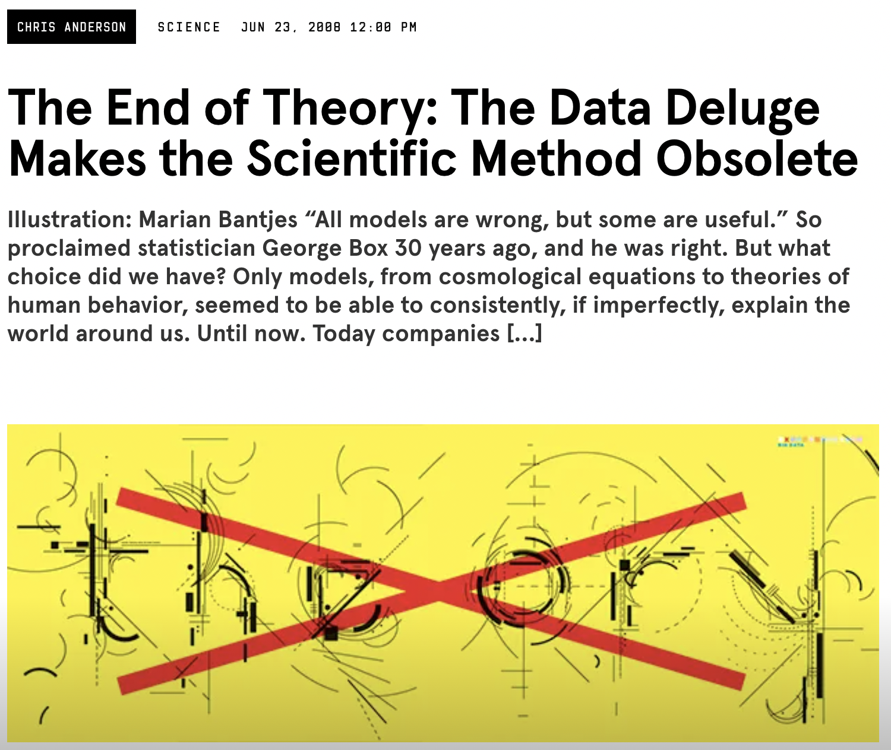

## Reading Prompt

*Data Feminism* [@dignazio2020data], Ch. 1:

Define/describe one of the following terms and explain why it matters for data-based analysis:

- Matrix of Domination
- Privilege Hazard

::: {.notes}
Speaker notes go here.
:::

---

## Announcements

- **Office Hours Today**: 3:00-4:30 pm (SSCO 2048)
- **Data News Thursday**: 
  - Dylan Provencio, Mana Ahmadi, Nathan Saavedra, Maryam Gauba, Jendrik Diaz
  - Also: Reading response from DF Ch 6
- **Refresh your syllabus** after Thurs (reading shift for next week)
- Confusion about *independent* and *dependent variables*: We will go over this more starting next week!

::: {.notes}
Speaker notes go here.
:::

---

## Do the numbers speak for themselves? 

:::: {layout="[1,1]"}

::: {#first-column}

:::

::: {#second-column .fragment}

. . .

All analyses involve (subjective) human judgments.
:::

::::

::: {.notes}
Speaker notes go here.
:::

---

## Recall: The production of data is intertwined with **human judgment.** {style="font-size: 0.8em;"}

. . .

- All data is **cooked** (and hopefully *cooked with care*)

. . .

> "The *context* of data — **why** it was collected, **how** it was collected, and **how** it was transformed [and **how** it is analyzed] — is always relevant. There is, then, no such thing as context-free data, and thus data cannot manifest the kind of perfect objectivity that is sometimes imagined" (Barrowman).

::: {.incremental}
- Statistical analysis requires (hopefully reasonable) human decisions ([Race + Red Cards](https://doi.org/10.1177/2515245917747646))
  - Features we take into consideration (covariates / control variables)
  - Statistical models we employ
:::

. . .

Is it necessarily **bad** that our data/analyses are shaped by **human judgement** and the **subjective contexts** in which they are generated?

. . .

- Not necessarily bad, but inevitable. 

::: {.notes}
Speaker notes go here.
:::

---

## [Data Feminism](https://data-feminism.mitpress.mit.edu/){target="_blank"} 

:::: {layout="[55, 45]"}

::: {#first-column}

::: {.fragment}
Does this human judgment reflect / influence all of us equally?
:::

::: {.fragment}
  - No! Data is subjective — and can reinforce power inequities
::: 

::: {.fragment}
**Data feminism:** Power is not distributed equally in the world, and this influences how our data is generated and used.
:::

::: {.fragment}
- Standard practices in data science (and *political science*) can **reinforce** (or **challenge!!**) existing power differentials.
:::

:::

::: {#second-column}

:::

::::

::: {.notes}
Speaker notes go here.
:::

---

## [Data Feminism](https://data-feminism.mitpress.mit.edu/){target="_blank"} 

:::: {layout="[55, 45]"}

::: {#first-column}

::: {.fragment}
**Discussion**:
:::

::: {.incremental}
- What is one thing from the reading you **learned** or one thing that **suprised** you?
- What is one way that the reading prompted you to **think differently** about the data you encounter in your own life?
:::

:::

::: {#second-column}

:::

::::

::: {.notes}
Speaker notes go here.
:::

---

## What is *POWER*? {style="font-size: 0.9em;"}

::: {.incremental}
- **Power:** "the current configuration of structural privilege and structural oppression, in which some groups experience unearned advantages… and other groups experience systematic disadvantages."
- **Minoritized groups:** People who are actively devalued and oppressed by a more powerful social group (dominant group) that has more access to economic, social, and political resources.
- **Matrix of domination** (dimensions of **power**) (Collins 1990):
  - *Structural domain:* Laws, policies, mechanisms of enforcement that directly target minoritized groups
  - *Disciplinary domain:* Rules or procedures that (perhaps indirectly) manage or discipline minoritized groups
  - *Hegemonic domain:* Social norms — culture, media, ideas — that send oppressive messages about a minoritized group
  - *Interpersonal domain:* Everyday oppressive experiences of minoritized individuals
:::

::: {.notes}
PULL EXAMPLES OF WHAT THIS LOOKS LIKE!!!
:::

---

## Matrix of Domination {style="font-size: 0.9em;"}

How might power operate in each domain for an **undocumented parent**?

:::: {.grid layout="[1,1]"}

::: {.grid-item .fragment .fade-in}
::: {style="text-align: center;"}
**Structural domain**

. . .

{style="display:block; max-height:24vh; max-width:80%; width:auto; margin:0.15em auto;"}
:::
:::

::: {.grid-item .fragment .fade-in}
::: {style="text-align: center;"}
**Disciplinary domain**

. . .

{style="display:block; max-height:24vh; max-width:80%; width:auto; margin:0.15em auto;"}
:::
:::

::: {.grid-item .fragment .fade-in}
::: {style="text-align: center;"}
**Hegemonic domain**

. . .

{style="display:block; max-height:24vh; max-width:92%; width:auto; margin:0.15em auto;"}
:::
:::

::: {.grid-item .fragment .fade-in}
::: {style="text-align: center;"}
**Interpersonal domain**

. . .

{style="display:block; max-height:24vh; max-width:92%; width:auto; margin:0.15em auto;"}
:::
:::

::::

---

## Missing perspectives, missing data {style="font-size: 0.9em;"}

What is the **privilege hazard**?

::: {.incremental}
- "The phenomenon that makes those who occupy the most privileged positions among us...so poorly equipped to recognize instances of oppression in the world (Data Feminism, p. 29)
- What are some risks associated with this **privilege hazard**?
- Among other issues: **missing datasets**
  - Examples from reading or your own observations?
- Other ways to think about **missing data**":
  - Who gets to tell their own story and self-dictate the data associated with themselves?
  - Who has their story told for them or their data dictated for them?
  - Ex: Women in the developing world asked about their contraception, not the sports they play.
:::

---

## What is *POWER*? (Adichie 2009)

::: {style="text-align: center; font-size: 0.5em; color: #666;"}
Clip: 0:10 – 3:00; 8:30 – 12:00
:::

::: {.notes}
I suggest that these same dynamics are playing out in how powerful entities build and analyze data for scientific inquiry.
:::

---

## The danger of a single story

::: {.incremental}
- What data was missing in Adichie's life?
- How could we run the risk of "the danger of a single story" when approaching social science research and/or data analysis? What harm(s) could this do?
- What are steps to reduce, mitigate, or reverse these dangers?
:::

::: {.notes}
Speaker notes go here.
:::

---

## TL;DR {.smaller}

- **Data is never neutral.** Every dataset is the product of human judgment and the unequal social conditions it was collected under [@dignazio2020data].
- **Human decisions run through the whole pipeline** — the questions we ask, how we produce data, and how we analyze it (which covariates, which models: *Race + Red Cards*).
- **Data feminism** starts from the premise that power is not distributed equally, and that standard data-science practice can reinforce — or challenge — those inequities.
- **The matrix of domination** (structural, disciplinary, hegemonic, interpersonal) is a tool for seeing how power operates across those domains.
- **The privilege hazard** leaves those in the most privileged positions least equipped to notice oppression — producing *missing data* and *missing datasets*.
- **The danger of a single story:** who gets to tell their own story, and who has it told for them, shapes what the data can say.

---

## References {.smaller}

::: {#refs}
:::
