## Announcements

::: {.notes}
Speaker notes go here.
:::

---

## Wrap up from last class

::: {.notes}
Speaker notes go here.
:::

---

## Reading Prompt

*Data Feminism* [@dignazio2020data], Chapters 4 & 6:

::: {.notes}
Speaker notes go here.
:::

---

## What Gets Counted Counts {.smaller}

The numbers don't speak for themselves

D'Ignazio and Klein 2020, Chapters 4 and 6

::: {.notes}
Speaker notes go here.
:::

---

## Discussion {.smaller}

- What was a main point/argument of your chapter?
- What is one example that demonstrates this point?
- How could the use of data reinforce power (matrix of domination/structural oppression or the danger of a single story) if one does not take this point seriously?
- What guideline(s) could you propose researchers use in order to avoid reinforcing unearned advantages / unearned oppression?

::: {.notes}
Speaker notes go here.
:::

---

## Power can be sustained by data science {.smaller}

**Flawed assumptions that too many scientists adopt:**

::: {.incremental}
- **More** data is always better
- Data are **neutral** inputs
- Data/Conclusions won't be used for **harmful actions**
- We can focus on individuals today without accounting for **root causes of injustice** (e.g., time, history, differential power)
- Power can be *sustained* by data science
:::

::: {.notes}
Speaker notes go here.
:::

---

## Human judgment in data can reinforce power {.smaller}

**Multiple stages:** data gathering · data analysis · presentation of results · how results are used

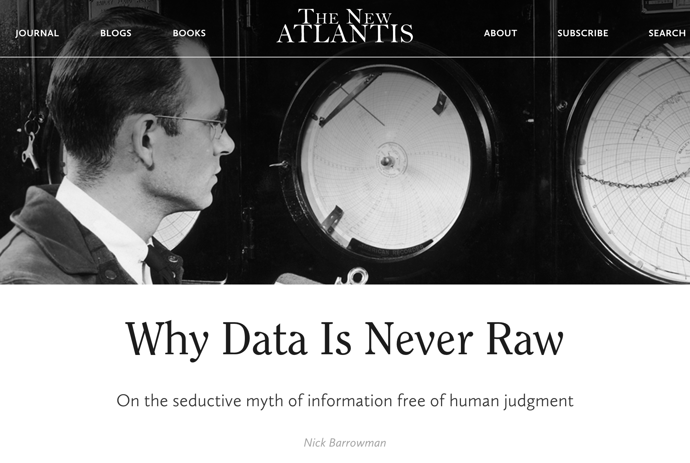

::: {.notes}
Speaker notes go here.
:::

---

## Human judgment in data can reinforce power {.smaller}

**Multiple stages:** data gathering · data analysis · presentation of results · how results are used

**Problem:**

::: {.incremental}
- Datasets ***should*** reflect the population it purports to represent.
- Data-gathering techniques can ***instead*** reflect systems of oppression that become naturalized as "the way things are" (104).
- Open-source big data sets → little information about how/why those datasets were collected.
- Ex: Classification systems can force people to classify themselves inappropriately.
:::

::: {.notes}
Speaker notes go here.
:::

---

## Human judgment in data can reinforce power {.smaller}

**Multiple stages:** data gathering · data analysis · presentation of results · how results are used

**Result:**

::: {.incremental}
- **Exclude** some people and leave others misrepresented, uncounted, invisible, or lumped together as a "single story."
- **Ex: In a survey of eligible US voters:**
- Examples of excluded populations?
- Examples of surveyed people who remain uncounted/invisible?
:::

::: {.notes}
Speaker notes go here.
:::

---

## Human judgment in data can reinforce power {.smaller}

**Multiple stages:** data gathering · data analysis · presentation of results · how results are used

**Consequences** of forcing survey respondents to classify themselves inappropriately?

::: {.incremental}
- Personal distress
- Erase identities; hide widespread collective oppression
- Influence allocation of resources and policy decisions
- Reinforce (false) ideas that socially constructed categories are natural
:::

::: {.notes}
Speaker notes go here.
:::

---

## Human judgment in data can reinforce power {.smaller}

**Multiple stages:** data gathering · data analysis · presentation of results · how results are used

***Paradox of exposure:***

::: {.notes}
Speaker notes go here.
:::

---

## Human judgment in data can reinforce power {.smaller}

**Multiple stages:** data gathering · data analysis · presentation of results · how results are used

***Paradox of exposure:*** When those groups who could benefit from being counted also face potential harm or dangers in being counted.

. . .

. . .

::: {.notes}
Speaker notes go here.
:::

---

## Human judgment in data can reinforce power {.smaller}

**Multiple stages:** data gathering · data analysis · presentation of results · how results are used

***Paradox of exposure:*** When those groups who could benefit from being counted also face potential harm or dangers in being counted.

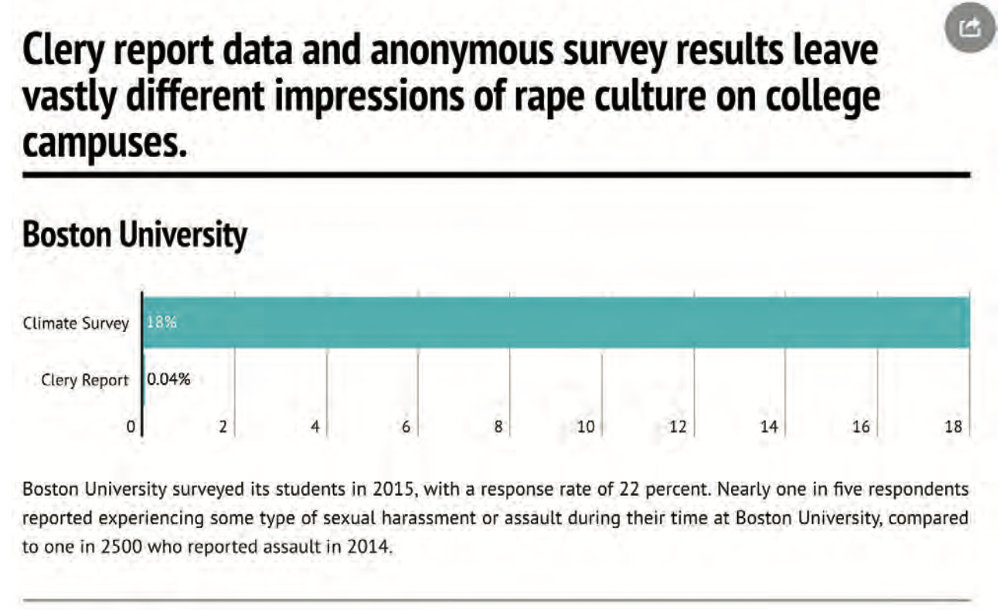

D'Ignazio and Klein (2020, 158). Courtesy of Patrick Torphy, Michaela Halnon, and Jillian Meehan, 2016.

::: {.notes}
Speaker notes go here.
:::

---

## Human judgment in data can reinforce power {.smaller}

**Multiple stages:** data gathering · data analysis · presentation of results · how results are used

**Solution?**

::: {.incremental}
- The person evaluating that knowledge / dataset [YOU!] should consider the context under which the data was created to avoid:
- reaching factually wrong conclusions
- causing harm, reinforcing unjust status quo
:::

::: {.notes}
Speaker notes go here.
:::

---

## Human judgment in data can reinforce power {.smaller}

**Multiple stages:** data gathering · data analysis · presentation of results · how results are used

**Ask yourself:**

::: {.incremental}
- Which **power imbalances** led to silences in the dataset or missing data?
- Who has **conflicts of interest** that prevent transparency about the data?
- **Whose knowledge** about an issue has been marginalized?
:::

**Ex: In a survey of eligible US voters:** What **information** do you need to know in order to understand how your dataset was collected?

::: {.notes}
Speaker notes go here.
:::

---

## Human judgment in data can reinforce power {.smaller}

**Multiple stages:** data gathering · data analysis · presentation of results · how results are used

::: {.notes}
Speaker notes go here.
:::

---

## Human judgment in data can reinforce power {.smaller}

**Multiple stages:** data gathering · data analysis · presentation of results · how results are used

**Think carefully about:**

::: {.incremental}
- How you **use/transform** your variables
- What **control variables** you include
- How you **present your results**
:::

::: {.notes}
Speaker notes go here.
:::

---

## Human judgment in data can reinforce power {.smaller}

**Multiple stages:** data gathering · data analysis · presentation of results · how results are used

::: {.notes}
Speaker notes go here.
:::

---

## Presentation of results {.smaller}

**Example:** Among 45,000 first-time incarcerated people, white people are more likely to receive mental health diagnosis/treatment, while Black and Latino/a/x people are more likely to receive punishment. ***How to present the results?***

. . .

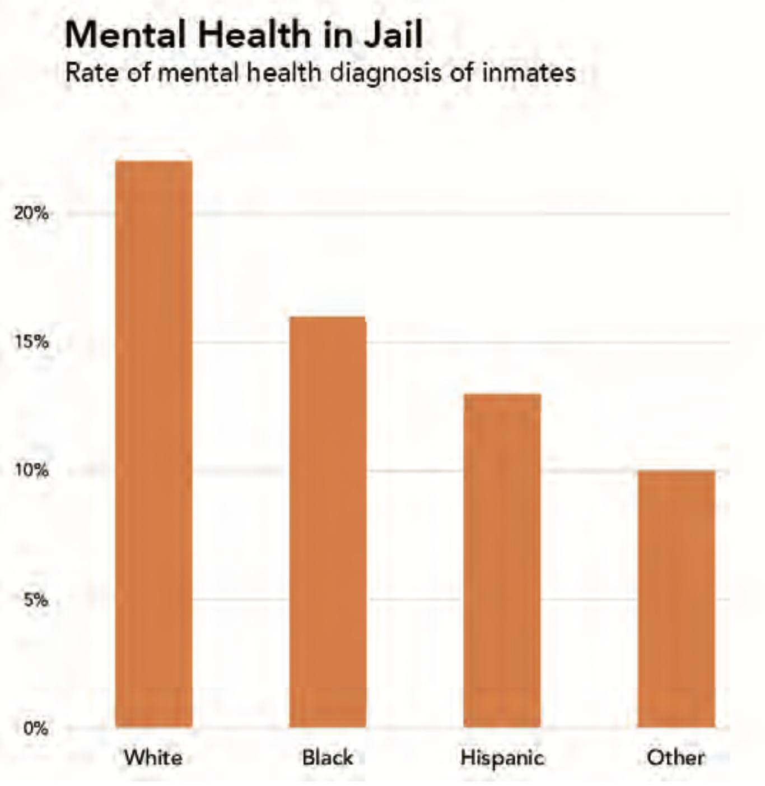

. . .

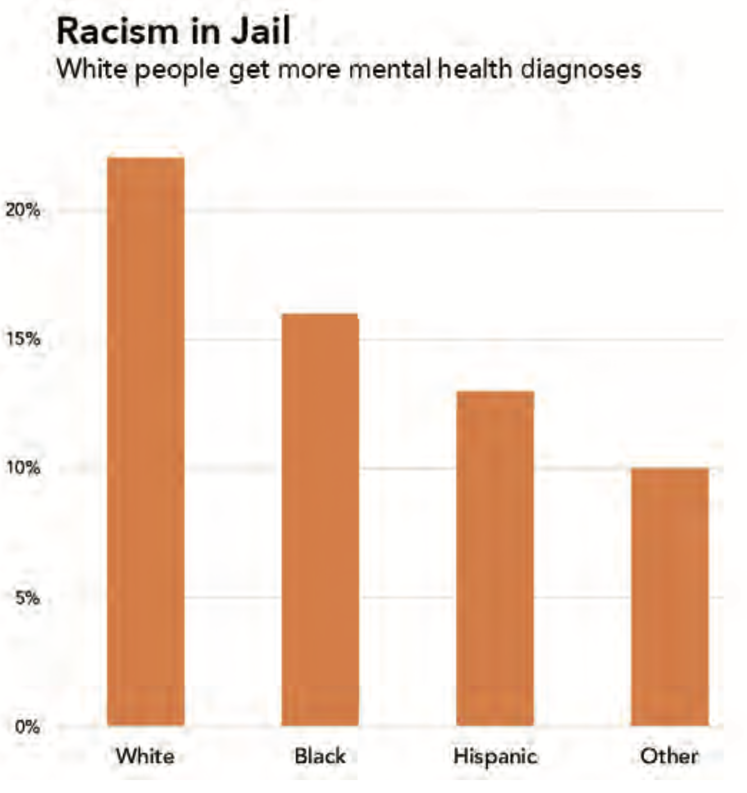

::: {.notes}
Speaker notes go here.
:::

---

## Human judgment in data can reinforce power {.smaller}

**Multiple stages:** data gathering · data analysis · presentation of results · how results are used

::: {.notes}
Speaker notes go here.
:::

---

## Ex from Criminal Justice {.smaller}

:::: {layout="[45, 55]"}

::: {#first-column}

::: {.fragment}
The **"New Jim Code"**: using aggregated data about *social groups* to make decisions about *individuals.*
:::

::: {.fragment}
Past data are products of structurally unequal conditions.
:::

::: {.fragment}
Data are not raw — data are products of unequal social relations.
:::

::: {style="font-size: 0.8em; color: #444; margin-top: 1em;"}
@dignazio2020data [p. 54]
:::

:::

::: {#second-column}
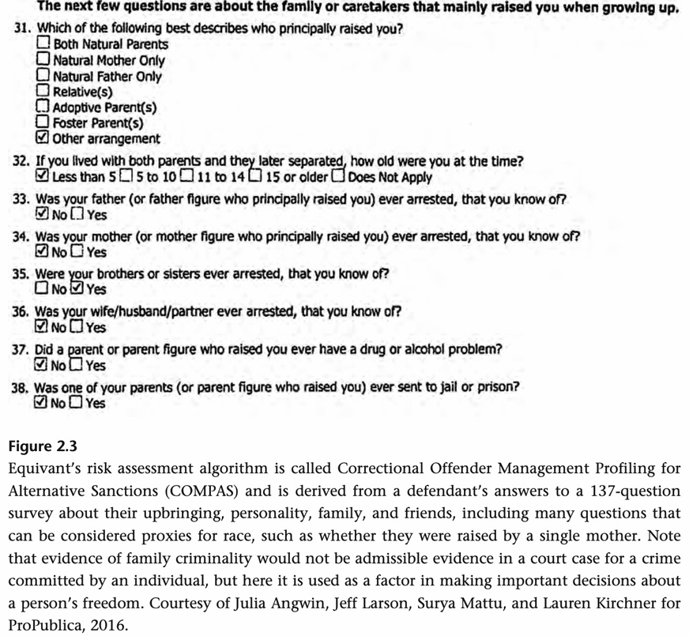
:::

::::

::: {.notes}
Speaker notes go here.
:::

---

## Ex from Criminal Justice {.smaller}

:::: {layout="[35, 65]"}

::: {#first-column}

:::

::: {#second-column}
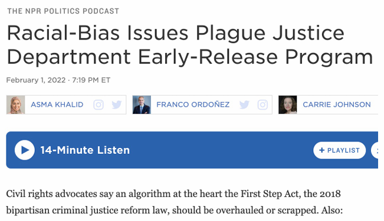

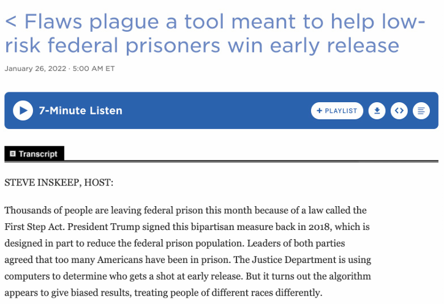
:::

::::

::: {.notes}
Speaker notes go here.
:::

---

## Solutions? {.smaller}

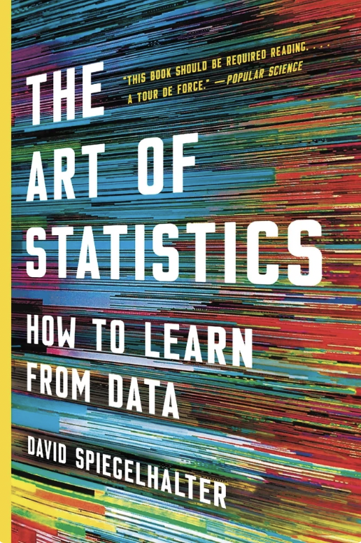
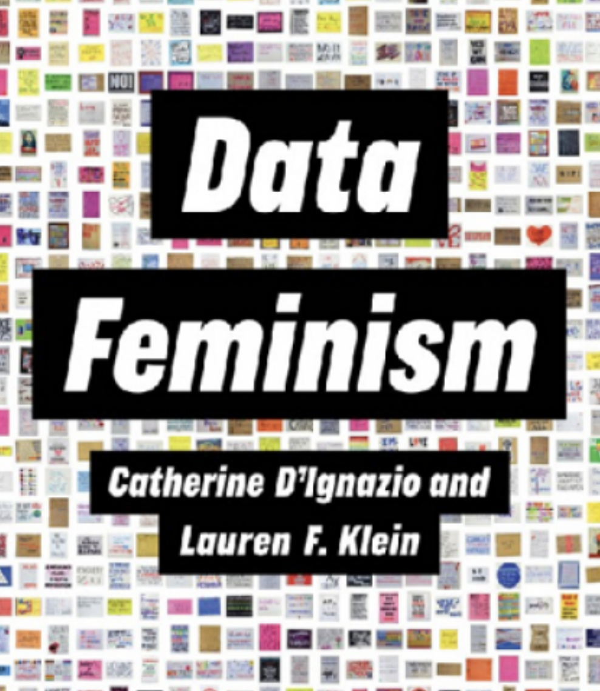

::: {.notes}
Speaker notes go here.
:::

---

## Data feminist solution? {.smaller}

::: {.incremental}
- Examine and, if necessary, rethink the assumptions and beliefs behind our classification infrastructure.
- Consistently probe who is doing the counting and whose interests are being served (and whose interests are being ignored or violated).
- Devise counting/classification schemes with these values in mind.
- *"Counting and measuring do not always have to be tools of oppression. We can also use them to hold power accountable, to reclaim overlooked histories, and to build collectivity and solidarity."* (DK 2020, 123)
:::

::: {.notes}
Speaker notes go here.
:::

---

## For Tuesday:

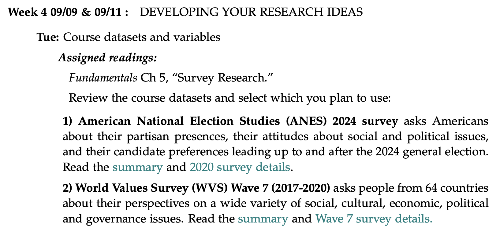

::: {.notes}
Speaker notes go here.
:::

---

## Understanding bias in AI

::: {.notes}
Speaker notes go here.
:::

---

## Text AI in a nutshell {.smaller}

**How data gathering stage generates bias:**

::: {.incremental}
- Take all the digitized (English) text
- Use this text to "learn" about the meaning and use of each word
- Represent this meaning numerically (multi-dimensional vector for each word) → "word embeddings"
:::

. . .

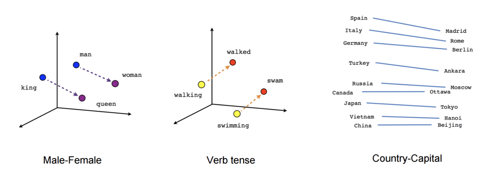

https://cbail.github.io/textasdata/word2vec/rmarkdown/word2vec.html

::: {.notes}
Speaker notes go here.
:::

---

## Text AI in a nutshell {.smaller}

**How data gathering stage generates bias:**

- Take all the digitized (English) text
- Use this text to "learn" about the meaning and use of each word
- Represent this meaning numerically (multi-dimensional vector for each word) → "word embeddings"

. . .

. . .

Biases and exclusions that exist in this original text data become recreated in the word embeddings.

::: {.notes}
Speaker notes go here.
:::

---

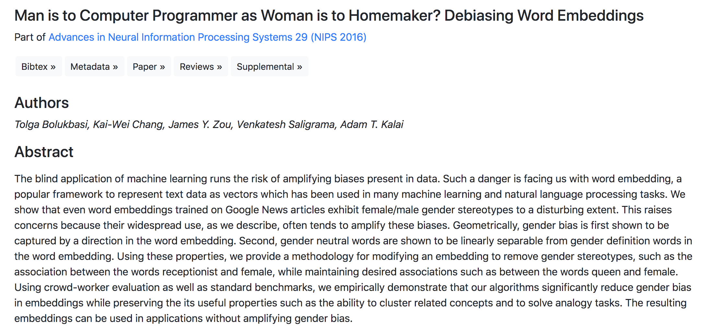

. . .

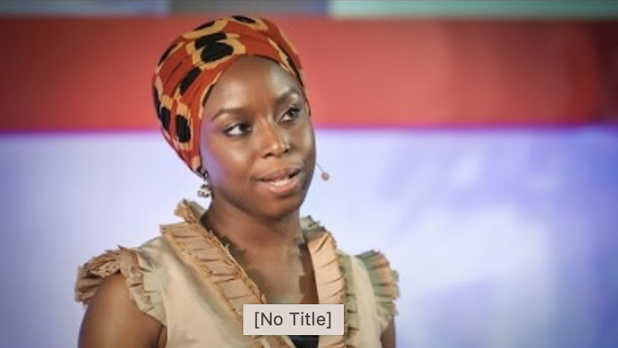

::: {.notes}
Speaker notes go here.
:::

---

## Text AI in a nutshell {.smaller}

**Real-world example of:**

::: {.incremental}
- Big, supposedly "**open**" data tools masking how they were generated
- **Power imbalances** leading to silences in the dataset
- Data contributing to normalizing certain power imbalances as "the way things are."
:::

::: {.notes}
Speaker notes go here.
:::

---

# Slides not used {background-color="#2c3e50"}

---

## Why is power often sustained by data science? {.smaller}

**Flawed assumptions that too many scientists adopt:**

- More data is always better
- Data are neutral inputs
- Data/Conclusions won't be used for nefarious "downstream" actions
- Even our notions of *ethics* and other values that focus on individuals do not sufficiently account for root causes of injustice (e.g., time, history, differential power)

"A racist society will give you a racist science" because "we cannot filter out the downstream effects of sexism and racism without also addressing their root causes" (DK 33).

::: {.notes}
Speaker notes go here.
:::

---

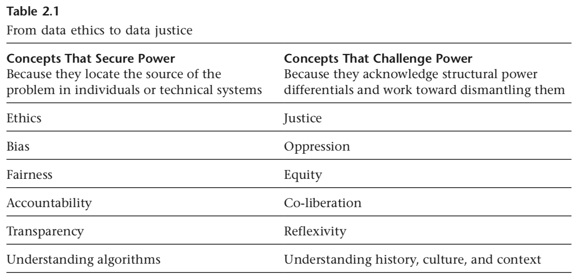

. . .

::: {style="text-align: center; font-size: 0.95em;"}
"Oppression is real, historic, ongoing, and worth dismantling" (D'Ignazio and Klein 2020, 60–61)
:::

::: {.notes}
"Concepts on the left are inadequate on their own to account for the root causes of structural oppression. By not taking root causes into account, they limit the range of responses possible to challenge power and work toward justice. In contrast, the concepts on the right start from the basic feminist belief that oppression is real, historic, ongoing, and worth dismantling."
:::

---

## Beyond fairness, bias, transparency {.smaller}

::: {.incremental}
- **Fairness:** resources/punishments should be distributed according to what is happening in the **present moment**, AND ALSO:
- **Fairness → Equity:** takes into account **present** power differentials and (re)distributes resources accordingly
- **Bias:** belief that racism or sexism is due to bad actors, AND ALSO:
- **Bias → Oppression:** understanding that how society is structured systematically oppresses people on the basis of their race or sex/gender
- **Transparency:** being clear about the decisions you are making (e.g., collecting or analyzing the data), AND ALSO:
- **Transparency → Reflexivity:** the ability to reflect on and take responsibility for one's own position within the multiple, intersectional dimensions of the matrix of domination.
:::

::: {.notes}
Speaker notes go here.
:::

---

## In short… {.smaller}

::: {.incremental}
- **Counting and classifying can:**
- Become tools of power
- Used to dominate, discipline, exclude
- Reflect a society's values and biases → reinforce inaccurate, harmful ideas and practices
- Create inclusive knowledge
- Expand access to resources
- Challenge harmful classification schemes
:::

::: {.notes}
Speaker notes go here.
:::

---

## For Thursday:

. . .

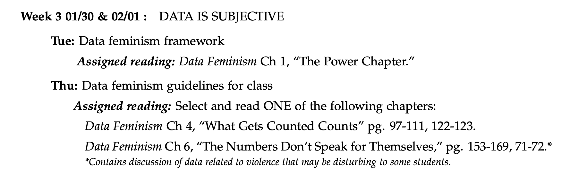

::: {.notes}
Speaker notes go here.
:::

---

## {.smaller}

::: {.fragment}
*"But experts and non-experts alike encounter the world not merely through sense experiences but **through frameworks of understanding shaped by numerous factors including theories, values, norms, and faith**. It may be tempting to suppose that this context can simply be set aside. But assumptions, when not made explicit, do not simply cease to exist. Rather, they influence the direction of inquiry, the choice of measurements, the way the data is collected and transformed, and the conclusions that are drawn."*
:::

::: {.fragment}
Does this mean we dismiss all data out-of-hand??!?
:::

::: {.fragment}
**Instead: actively consider sources of bias and/or harmful downstream uses. Look for them, name them, think through what this means for your conclusions.**
:::

::: {.notes}
Speaker notes go here.
:::

---

## Why Data Science? {.smaller}

::: {.incremental}
- **Looking for patterns in large data volumes**
- Poli sci: honors thesis, Ph.D., research for government, policy think tank, journalism, non-profit org, finding innovative solutions…
  - E.g., food insecurity
- Data science (generally): high-demand, versatile, lucrative career
- **Necessary skills that you will begin to develop in this class:**
- Statistics and statistical inference
- Probability
- Programming language (R)
- Data wrangling
- Machine learning (kind-of)
:::

::: {.notes}
Speaker notes go here.
:::

---

## Beyond the binaries {.smaller}

When could binary variables or single categories be problematic?

::: {.incremental}
- **Forcing respondents to classify themselves inappropriately:**
- Gender and sex binaries
- Racial classifications
- **Implications:**
- Personal distress
- Erases identities and hides widespread collective oppression
- Allocation of resources and policy decisions
- Reinforces (false) ideas that socially constructed categories are natural or "the way things are" and prevents us from questioning how our classification systems are constructed.
- It is important to collect data that reflects the population it purports to represent!!
:::

::: {.notes}
Speaker notes go here.
:::

---

## TL;DR {.smaller}

- **Data is never neutral.** Every dataset is the product of human judgment and the unequal social conditions it was collected under [@dignazio2020data].
- **Power shapes data.** The *matrix of domination* — structural, disciplinary, hegemonic, interpersonal — operates at every stage: data gathering, analysis, presentation, and use.
- **Counting can dominate or empower.** Classification schemes can exclude, distort, and naturalize oppression — or they can hold power accountable and expand access.
- **The paradox of exposure:** the groups who would most benefit from being counted are often the ones most endangered by it.
- **Your job as an analyst:** ask who is missing, who has conflicts of interest, and whose knowledge has been marginalized — before you draw conclusions.

---

## References {.smaller}

::: {#refs}
:::
