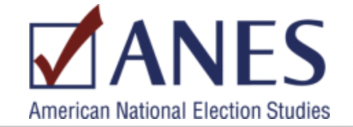
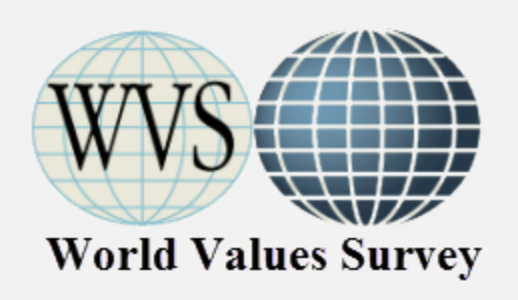
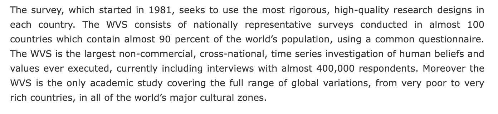
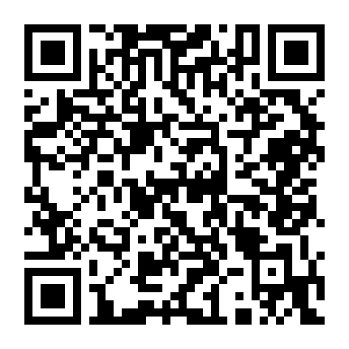
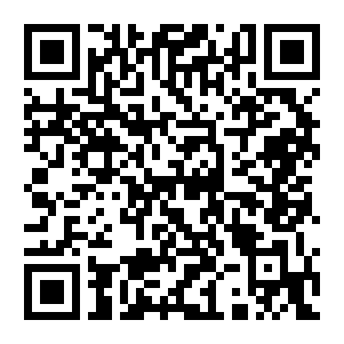
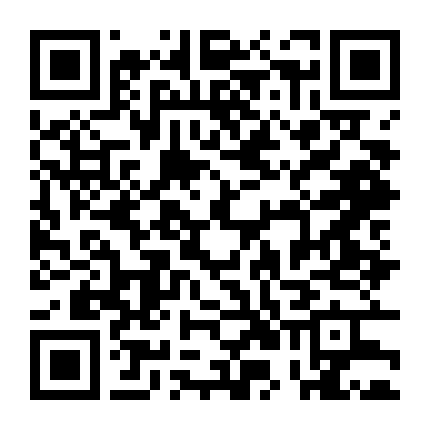
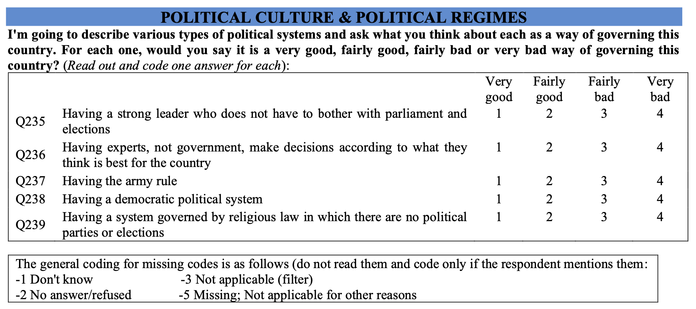
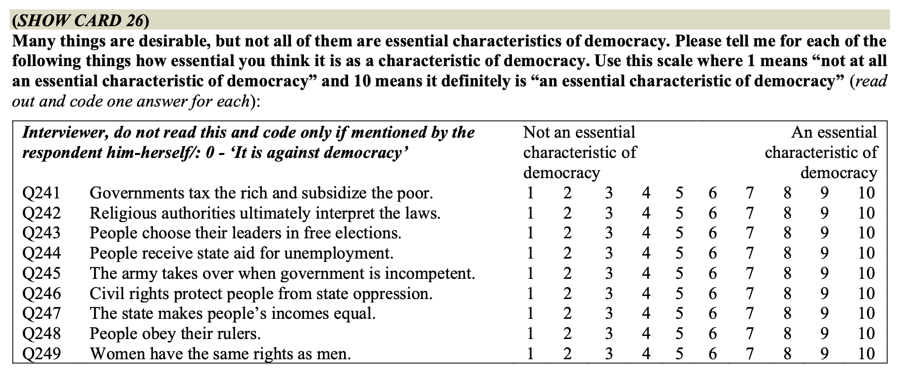
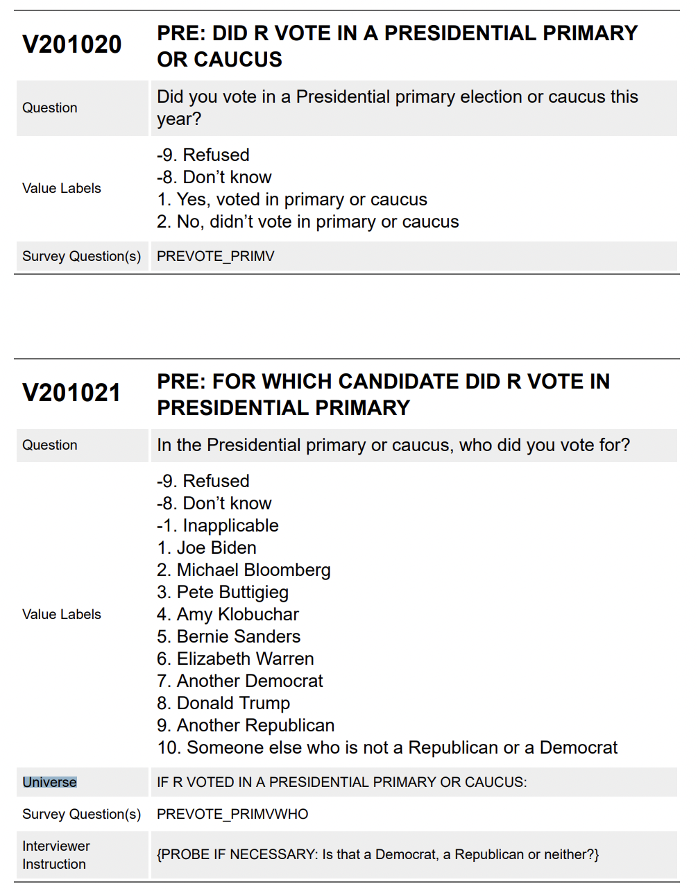

<style>
/* Deck 6: plain disc bullets at every nesting level.
   The clean theme styles nested lists (ul ul) with a "→" arrow via li::before
   and list-style:none; on this deck a disc shows through too, so sub-items
   render with BOTH a bullet and an arrow. Kill the arrow, restore the disc. */
.reveal .slides ul ul { list-style: disc !important; }
.reveal .slides ul ul li::before { content: none !important; display: none !important; }

/* Emphasis shortcut: write  [text]{.hl}  for teal-bold emphasis (the deck's standard highlight). */
.reveal .hl { color: #107895 !important; font-weight: 700; }
</style>

## Reading Prompt

Answer **both** questions: 

- What is one thing you learned about survey data from today's chapter?
- Which survey (ANES or WVS) do you think you will use and why?

::: {.notes}
Speaker notes go here.
:::

---

## Announcements

::: {.notes}
Speaker notes go here.
:::

---

## Lecture objectives

:::{.incremental}
- Introduce the components of a survey dataset
- Select possible variables of interest
- Brainstorm IV/DV pairings
  - You should all leave with an independent variable ("cause") and a dependent variable ("outcome")!
:::


# Course Datasets {background-color="#2c3e50"}


## Option 1: American National Election Survey (ANES) {style="font-size: 0.9em;"}



<span style="color: #107895; font-weight: bold;">About the survey</span>

::: {.incremental}
- **Year:** 2024 Time Series Study
- **Population:** U.S. eligible voters
- **Sample:** 5,521 pre-election; 4,964 also post-election
- **What it covers:** US voters' attitudes and perspectives about politics, policies, and pressing social issues.
- Read about it <a href="https://electionstudies.org/data-center/2024-time-series-study/" target="_blank">here</a>!
:::

::: {.notes}
Speaker notes go here.
:::

---

## Option 1: American National Election Survey (ANES) {style="font-size: 0.9em;"}


<span style="color: #107895; font-weight: bold;">Survey components and terms</span>

::: {.incremental}
- **Unit of analysis:** Individual respondents
- **Observations**: Each individual person interviewed ("respondent") <span style="color: #107895;">→</span> *rows*
  - 5,521 respondents ($n=5521$)
- **Variables**: Each specific question asked <span style="color: #107895;">→</span> *columns*
  - +1,000 variables!
  - **Variable label:** What each survey question is called/labeled
    - V201001 – V201658: Pre-election survey questions
    - V202001 – V202645: Post-election survey questions
  - **Variable value:** How each person responded to each question
:::


::: {.notes}
Speaker notes go here.
:::

---

## Variable V241177: Political Ideology {style="font-size: 0.85em;"}

*"Where would you place yourself on this scale, or haven't you thought much about this?"*

::: {style="font-size: 0.8em; margin-top: -0.5em;"}
1: Extremely liberal; 4: Moderate; middle of the road; 7: Extremely conservative
:::

<!--

-->

. . .

:::: {layout="[55, 45]"}

::: {#first-column}
<div id="ideo-explorer" style="max-width: 920px; margin: 0.4em auto;">
<div id="ideo-scale" style="display: flex; gap: 0.3em; justify-content: center; flex-wrap: wrap;"></div>
<div id="ideo-detail" style="margin-top: 0.7em; min-height: 8em; padding: 0.6em 0.8em; border-radius: 8px; background: rgba(16,120,149,0.08); border: 1px solid rgba(16,120,149,0.3); font-size: 0.85em;">
<em>Click a point above to see a measurement note.</em>
</div>
</div>

::: {.fragment}
<p style="font-size: 0.72em; margin-top: 0.6em; color: #444;"><strong>Note:</strong> This is a <strong>self-report</strong> measure — it captures how people <em>label</em> themselves, not necessarily their positions on specific policies.</p>
:::
:::

::: {#second-column .fragment}
```{r}
#| label: ideology-hist
#| echo: true
#| fig-width: 4.2
#| fig-height: 3.6
#| out-width: "100%"

suppressMessages(library(tidyverse))

ideology <- tibble(
  score = factor(c("1", "2", "3", "4", "5", "6", "7", "DK"),
                 levels = c("1", "2", "3", "4", "5", "6", "7", "DK")),
  n = c(250, 819, 543, 1187, 594, 1030, 309, 719)
) |>
  uncount(n)

ggplot(ideology, aes(x = score, fill = score == "DK")) +
  geom_bar(color = "white", show.legend = FALSE) +
  scale_fill_manual(values = c(`TRUE` = "#999999", `FALSE` = "#107895")) +
  labs(
    x = "Ideology (1–7; DK = haven't thought much)",
    y = "Respondents"
  ) +
  theme_minimal(base_size = 11) +
  theme(
    panel.grid.minor = element_blank(),
    plot.background = element_rect(fill = "transparent", color = NA),
    panel.background = element_rect(fill = "transparent", color = NA)
  )
```

::: {style="text-align: center; font-size: 0.5em; color: #666;"}
Real 2024 pre-election marginals for `V241177` (N = 5,521 total; 5,451 substantive responses after excluding 70 refused/error; unweighted).
:::
:::

::::

<script>
(function () {
  var mount = document.getElementById("ideo-scale");
  if (!mount || mount.dataset.loaded) return;
  mount.dataset.loaded = "1";
  var detail = document.getElementById("ideo-detail");
  var points = [
    {n: "1", pct: 4.6, N: 250, label: "Extremely liberal", note: "The most doctrinaire end of the scale — the smallest cell on this side. Watch group sizes if you split ideology into a binary or few-category model."},
    {n: "2", pct: 15.0, N: 819, label: "Liberal", note: "A common cutpoint: many 3-category recodes group 1–3 as “liberal.”"},
    {n: "3", pct: 10.0, N: 543, label: "Slightly liberal", note: "The two “slightly” categories (3 and 5) are a judgment call — fold them into “moderate,” or into “liberal”/“conservative”? Either is defensible, but the choice changes your results — same idea as Silberzahn et al.’s covariate choices."},
    {n: "4", pct: 21.8, N: 1187, label: "Moderate; middle of the road", note: "The modal category. Does “moderate” mean genuinely centrist — or does it also catch people who haven’t formed a clear ideological identity?"},
    {n: "5", pct: 10.9, N: 594, label: "Slightly conservative", note: "See point 3 — the same recoding judgment call applies on this side of the scale."},
    {n: "6", pct: 18.9, N: 1030, label: "Conservative", note: "A common cutpoint: many 3-category recodes group 5–7 as “conservative.”"},
    {n: "7", pct: 5.7, N: 309, label: "Extremely conservative", note: "The most doctrinaire end of the scale — the smallest cell on this side."},
    {n: "DK", pct: 13.2, N: 719, label: "Haven’t thought much about it", note: "This isn’t random missing data — it's larger than either \"extreme\" category. Who tends to answer this way? Dropping it listwise can bias your estimates if nonresponse correlates with your other variables."}
  ];
  points.forEach(function (p) {
    var box = document.createElement("div");
    box.textContent = p.n;
    box.style.cssText = "cursor:pointer; padding:0.5em 0.75em; border-radius:6px; border:2px solid #107895; font-weight:bold; font-size:0.9em; min-width:2em; text-align:center; color:#107895; background:transparent; transition: background 0.15s, color 0.15s;";
    box.addEventListener("click", function () {
      Array.prototype.forEach.call(mount.children, function (c) {
        c.style.background = "transparent";
        c.style.color = "#107895";
      });
      box.style.background = "#107895";
      box.style.color = "#fff";
      detail.innerHTML = "<strong>" + p.n + " — " + p.label + "</strong> — " + p.pct + "% (n=" + p.N.toLocaleString() + ")" +
        "<div style=\"height:10px; width:" + (p.pct * 4) + "%; max-width:100%; background:#107895; border-radius:4px; margin:0.4em 0;\"></div>" +
        p.note;
    });
    mount.appendChild(box);
  });
})();
</script>

<script>
(function () {
  // Find our own slide instead of hardcoding the heading slug, so renaming
  // this slide's title never breaks the plot<->code toggle.
  var thisScript = document.currentScript;
  var section = thisScript && thisScript.closest("section");
  if (!section) return;
  if (section.dataset.codeToggleLoaded) return;
  section.dataset.codeToggleLoaded = "1";

  var codeBlock = section.querySelector(".code-copy-outer-scaffold");
  var cell = section.querySelector(".cell");
  var img = section.querySelector(".cell-output-display img");
  if (!codeBlock || !cell || !img) return;

  // Put the code block exactly where the plot sits, so it swaps in place.
  cell.parentElement.insertBefore(codeBlock, cell);

  // Shrink-wrap the code box to its content (right border ends after the code).
  codeBlock.style.fontSize = "0.55em";
  codeBlock.style.lineHeight = "1.25";
  codeBlock.style.textAlign = "left";
  codeBlock.style.display = "none";      // hidden to start
  codeBlock.style.width = "fit-content";
  codeBlock.style.maxWidth = "100%";
  codeBlock.style.overflowX = "auto";
  codeBlock.style.height = "auto";
  codeBlock.style.maxHeight = "none";
  codeBlock.style.margin = "0";
  var pre = codeBlock.querySelector("pre");
  if (pre) {
    pre.style.height = "auto";
    pre.style.maxHeight = "none";
    pre.style.margin = "0";
    pre.style.padding = "0.4em 0.7em";
  }

  function showCode() {
    cell.style.display = "none";
    codeBlock.style.display = "block";
  }
  function showPlot() {
    codeBlock.style.display = "none";
    cell.style.display = "";
  }

  img.style.cursor = "pointer";
  img.title = "Click to see the R code";
  img.addEventListener("click", showCode);

  codeBlock.style.cursor = "pointer";
  codeBlock.title = "Click to go back to the histogram";
  codeBlock.addEventListener("click", showPlot);
})();
</script>

::: {.notes}
Click through all 8 as a class. Percentages are the real 2024 pre-election marginals for V241177 (N = 5,521; excludes ~70 refused/error cases), from the ANES 2024 Full Release codebook via SDA. Click the histogram itself to show/hide the ggplot code that made it.
:::

---

## Other available topics (ANES) {style="font-size: 0.9em;"}

::: {.incremental}
- **Presidential approval** → `V241134` Do you approve/disapprove of the President's handling of the job?
- **Gender attitudes** → `V242212` — How important is it that more women get elected to political office?
- **Climate change** → `V242322` — Do you favor/oppose increased regulation on greenhouse emissions?
- **Inflation / cost of living** → `V242173` — How important is the issue: cost of living
- **Immigration** → `V241267` — Should federal spending on tightening border security to prevent
illegal immigration be increased, decreased, or kept the same?
- **Gun control** → `V242326` — Do you favor/oppose background checks for gun purchases?
:::

. . .

::: {style="font-size: 0.85em; color: #666; margin-top: 0.6em;"}
These are not the only option for each topic, and not the only topics available! 

Source: <a href="https://sda.berkeley.edu/sdaweb/docs/anes2024full/DOC/hcbkh01.htm" target="_blank">ANES 2024 Full Release codebook</a>.
:::

::: {.notes}
Speaker notes go here.
:::

---

## Option 2: World Values Survey (WVS) {style="font-size: 0.9em;"}



::: {.incremental}
- **Year:** 2017–2022
- **Population:** Respondents from 64 countries
- **Sample:** 94,278
- **What it covers:** Attitudes about social and political values and beliefs across 66 countries.
  - **Note:** You will have to limit your analysis to 1-3 countries of your choice.
- Read about it <a href="https://www.worldvaluessurvey.org/WVSDocumentationWV7.jsp" target="_blank">here</a>!
:::

::: {.fragment}

:::

::: {.notes}
Speaker notes go here.
:::

---

## Option 2: World Values Survey (WVS) {style="font-size: 0.9em;"}


<span style="color: #107895; font-weight: bold;">Survey components and terms</span>

::: {.incremental}
- **Unit of analysis:** Individual respondents
- **Observations**: Each individual person interviewed ("respondent") <span style="color: #107895;">→</span> *rows*
  - 94,278 respondents ($n=94278$)
- **Variables:** each specific question asked <span style="color: #107895;">→</span> *columns*
  - 606 variables!
  - **Variable label:** What each survey question is called/labeled
    - Q1 – Q294B: Survey questions
    - A_YEAR, B_COUNTRY, etc: Demographics and identifiers
  - **Variable value:** How each person responded to each question
:::

::: {.notes}
Speaker notes go here.
:::

---

## Variables Q243 & Q249: Essential features to a democracy {style="font-size: 0.85em;"}

*How essential to a democracy is it that: People choose their leaders in free elections (Q243) or that: Women have the same rights as men (Q249)?*

::: {style="font-size: 0.7em;"}
1 = Not at all essential to democracy; 10 = definitely essential to democracy
:::

```{r}
#| label: wvs-hist-pooled
#| echo: false
#| fig-width: 7
#| fig-height: 3.0
#| out-width: "100%"

suppressMessages(library(tidyverse))

wvs_pooled <- tibble(
  variable = rep(c("Q243: free elections", "Q249: women's equal rights"), each = 10),
  score    = rep(1:10, 2),
  n = c(3450, 1396, 2067, 2622, 7249, 5429, 6648, 10301, 9580, 42535,
        3537, 1386, 1865, 2323, 7730, 5337, 6030,  9173, 9180, 45057)
)

ggplot(wvs_pooled, aes(x = factor(score), y = n)) +
  geom_col(fill = "#107895", color = "white") +
  facet_wrap(~variable) +
  labs(x = "Essential to democracy (1–10)", y = "Respondents") +
  theme_minimal(base_size = 11) +
  theme(
    panel.grid.minor = element_blank(),
    plot.background  = element_rect(fill = "transparent", color = NA),
    panel.background = element_rect(fill = "transparent", color = NA)
  )
```

<!--
::: {style="text-align: center; font-size: 0.5em; color: #666;"}
All 64 WVS Wave 7 countries pooled (n ≈ 91,500–92,000 valid; excludes "don't know" / no answer and the rare volunteered "against democracy". Unweighted.)
:::
-->

. . .

This is a **self-report** measure. It captures what people *say* democracy requires, not how their country is actually run.

::: {style="font-size: 0.6em; color: #666; margin-top: 0.8em;"}
Source: <a href="https://www.worldvaluessurvey.org/WVSDocumentationWV7.jsp" target="_blank">WVS Wave 7 Master Questionnaire</a>, items Q243 & Q249.
:::


::: {.notes}
Speaker notes go here.
:::

---

## Q243 & Q249: US vs. Germany {style="font-size: 0.85em;"}

<!-- Sweden is not in WVS Wave 7; Germany shown as the comparison.
     To compare other WVS7 countries, swap the count vectors below. -->

::: {style="font-size: 0.7em;"}
Percent of each country's respondents at each point on the 1–10 "essential to democracy" scale.
:::

```{r}
#| label: wvs-hist-us-de
#| echo: false
#| fig-width: 7
#| fig-height: 3.1
#| out-width: "100%"

suppressMessages(library(tidyverse))

wvs_cmp <- tibble(
  country  = rep(c("United States", "Germany"), each = 20),
  variable = rep(rep(c("Q243: free elections", "Q249: women's equal rights"), each = 10), 2),
  score    = rep(1:10, 4),
  n = c(
    35, 9, 20, 50, 345, 107, 116, 168, 183, 1515,   # US  Q243
    51, 17, 33, 41, 287, 101, 135, 219, 196, 1474,  # US  Q249
    13, 1, 6, 5, 27, 15, 15, 76, 74, 1277,          # DE  Q243
    21, 0, 4, 4, 23, 8, 22, 35, 62, 1331            # DE  Q249
  )
) |>
  group_by(country, variable) |>
  mutate(pct = 100 * n / sum(n)) |>
  ungroup()

ggplot(wvs_cmp, aes(x = factor(score), y = pct, fill = country)) +
  geom_col(position = "dodge", color = "white") +
  facet_wrap(~variable) +
  scale_fill_manual(values = c("United States" = "#107895", "Germany" = "#999999")) +
  labs(x = "Essential to democracy (1–10)", y = "% of country's respondents", fill = NULL) +
  theme_minimal(base_size = 11) +
  theme(
    legend.position  = "top",
    panel.grid.minor = element_blank(),
    plot.background  = element_rect(fill = "transparent", color = NA),
    panel.background = element_rect(fill = "transparent", color = NA)
  )
```

::: {style="text-align: center; font-size: 0.5em; color: #666;"}
WVS Wave 7. US n ≈ 2,550 valid; Germany n ≈ 1,520 valid. Unweighted. Germans rate both items closer to "definitely essential" (mean ≈ 9.6 vs US ≈ 8.5); note the US cluster at the "5" midpoint.
:::

::: {.notes}
Speaker notes go here.
:::

---

## More attitudes about democracy (and democratic backsliding) {style="font-size: 0.9em;"}

::: {.incremental}
- **Q238** — support for "having a democratic political system" (direct democracy-support item)
- **Q235** — support for "a strong leader who does not have to bother with parliament and elections" (classic authoritarian-preference item)
- **Q237** — support for "having the army rule"
- **Q243** — is "people choose their leaders in free elections" essential to democracy?
- **Q245** — is "the army takes over when government is incompetent" essential to democracy? (a high score here is itself a red flag — endorsing a coup as *democratic*)
:::

. . .

::: {style="font-size: 0.85em; color: #666; margin-top: 0.6em;"}
**Other WVS Wave 7 topics include**: Trust & social capital, economic satisfaction, gender attitudes & stereotypes, religion, happiness & well-being. Source: <a href="https://www.worldvaluessurvey.org/WVSContents.jsp?CMSID=Documentation" target="_blank">WVS Wave 7 documentation</a>.
:::

::: {.notes}
Speaker notes go here.
:::

---

# Exploring the available variables {background-color="#2c3e50"}

## Your topic(s) of interest

. . .

**What topic would you like to analyze in this class?**

::: {.incremental}
- [Option 1]{.hl}: Are you interested in explaining how something about your topic came about?
  - → Your topic is your **outcome** / **dependent variable**.
  - What are some **independent variable** factors that you think might cause or influence your topic?
- [Option 2]{.hl}: Are you interested in explaining what your topic might cause or influence?
  - → Your topic is your **cause** / **independent variable**.
  - What are some factors or circumstances that you think your topic might cause or influence?
:::

---

## Using surveys {style="font-size: 0.9em;"}

::: {.incremental}
- **What IS represented in surveys?**
  - People's reported **identities**
  - People's reported **circumstances**
  - People's reported **perceptions, opinions** (e.g., about policies, governments, social issues, etc.) or **behavior**
- **What IS NOT represented in surveys?**
  - Existence or content of policies
  - Frequencies of certain behaviors
  - Impact of policies (beyond people's opinions)
  - A geography's demographic information
  - Changes over time
:::

::: {.notes}
Speaker notes go here.
:::

---

## Let's find some variables about your topic! {style="font-size: 0.85em;"}

**In-class exercise:** Open your codebook (Canvas or QR codes). Search for 2–3 survey questions related to your topic of interest. I recommend using your computers keyword search function (Ctrl/Cmd-F).

:::: {layout="[1,1,1]"}

::: {#first-column}


::: {style="text-align: center; font-size: 0.7em;"}
**ANES — full codebook**<br>question wording + response categories
:::
:::

::: {#second-column}


::: {style="text-align: center; font-size: 0.7em;"}
**ANES — variable list**<br>quick names + one-line labels
:::
:::

::: {#third-column}


::: {style="text-align: center; font-size: 0.7em;"}
**WVS Wave 7 documentation**<br>questionnaire + codebook downloads
:::
:::

::::

::: {style="text-align: center; font-size: 0.55em; color: #666; margin-top: 0.4em;"}
**ANES:** use "Find" (Ctrl/Cmd-F) on the variable list, then look up the `Vxxxxxx` names in the codebook. &nbsp; **WVS:** the questionnaire is organized in thematic blocks — find your block, then its `Qxxx` items.
:::

::: {.notes}
Speaker notes go here.
:::

---

## Workshop your approach with a classmate {style="font-size: 0.85em;"}

::: {.incremental}
- Your political topic of interest
- 2-3 survey variables that begin to capture your topic of interest. What do you like about the variable(s)? What are some limitations to the variable(s)?
- Brainstorm:
  - Might there be a better way to capture your topic of interest?
    - **Think about your topic/variable as an outcome (DV).** What might be good IVs captured in the survey data that influence your topic? *When in doubt, what makes for a great IV?* A respondent's characteristics that likely pre-date their social/policy opinions.
    - **Think about your topic/variable as a cause of something else (IV).** What might be good DVs captured in the survey that are influenced by your topic? 
- Develop a research question you have about your topic, based on the variables in the survey. Ex: *Does gender shape people's attitudes toward climate change?*
- Record your work in the class [Google drive](https://docs.google.com/spreadsheets/d/17W2_PpL2DCbcXn6pim2iVZCAcC7JBVsnrd_Cf4BaUrU/edit?gid=0#gid=0) (Modules -> Course exercises -> Project IV/DV)
:::


::: {.notes}
Speaker notes go here.
:::


---

## For Thursday:

Assigned reading for our next class meeting:

::: {.incremental}
- @kellstedt2022fundamentals [Ch. 2, pp. 29–38], "The Art of Theory Building"
- Using <a href="https://scholar.google.com/" target="_blank">Google Scholar</a>, identify and skim one academic article related to your topic of interest.
:::

. . .

::: {style="font-size: 0.7em; color: #666; margin-top: 0.6em;"}
**Begin your Final Research Analysis Task 1: Theory and Hypothesis.** Full schedule on the <a href="https://skdreier.github.io/POLS2140/" target="_blank">syllabus</a>.
:::

::: {.notes}
Speaker notes go here.
:::

---

# Other survey features {background-color="#2c3e50"}

## Using surveys: what is a battery? {style="font-size: 0.9em;"}

What is a **battery**? A set of related questions asked together on the same response scale.

:::: {layout="[1,1]"}

::: {.grid-item .fragment .fade-in}

:::

::: {.grid-item .fragment .fade-in}

:::

::::

::: {.notes}
Speaker notes go here.
:::

---

## Using surveys: conditional response {style="font-size: 0.9em;"}

::: {.incremental}
- What is a **battery**?
- What is a **conditional response**? — a question that's only asked *if* an earlier question was answered a certain way (its "universe" depends on a prior response)
- What is the best way for me to look for topics that interest me?
:::



::: {.notes}
Speaker notes go here.
:::

---

## TL;DR {.smaller}

- **Observations are rows, variables are columns.** Each person interviewed is an observation; each question asked is a variable, with a *label* (`V241177`, `Q243`) and a *value* (the response).
- **ANES and WVS are both individual-level survey data** — but ANES is U.S.-only (2024 Time Series Study, ~5,500 respondents), while WVS spans 64 countries (Wave 7, 2017–2022, ~94,000 respondents) and requires you to justify a country/regional subset.
- **Surveys capture reported identities, circumstances, and opinions/behavior** — not policy content, behavior frequencies, policy impacts, or demographic/temporal facts about a place. A good IV is a respondent characteristic that likely *pre-dates* the opinion you're explaining.
- **Operationalizing a concept is a judgment call.** How you recode a 7-point scale (into 3 categories? a binary?), or which items you treat as "essential" to democracy, changes your results — the Silberzahn et al. lesson — and the same WVS items look different across countries (e.g. U.S. vs. Germany).
- **A battery is a set of related questions sharing one response scale; a conditional response is a question only asked if an earlier answer triggers it** — both shape how you'll need to read a codebook.
- **Next step:** select ANES or WVS, identify 1–3 candidate variables for your outcome of interest, and be ready to discuss their strengths and limitations.

---

## References {.smaller}

::: {#refs}
:::
