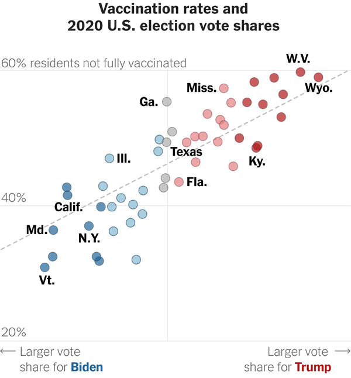
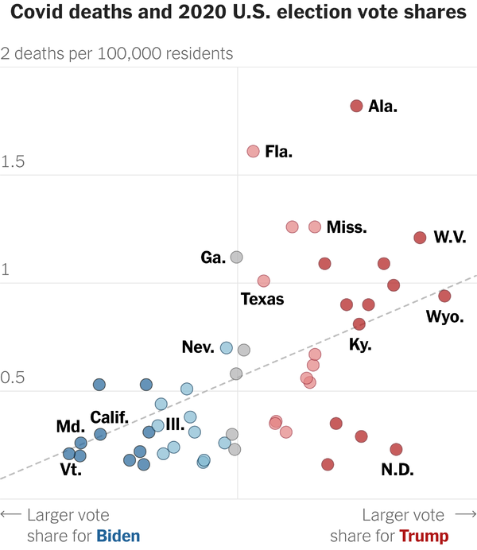
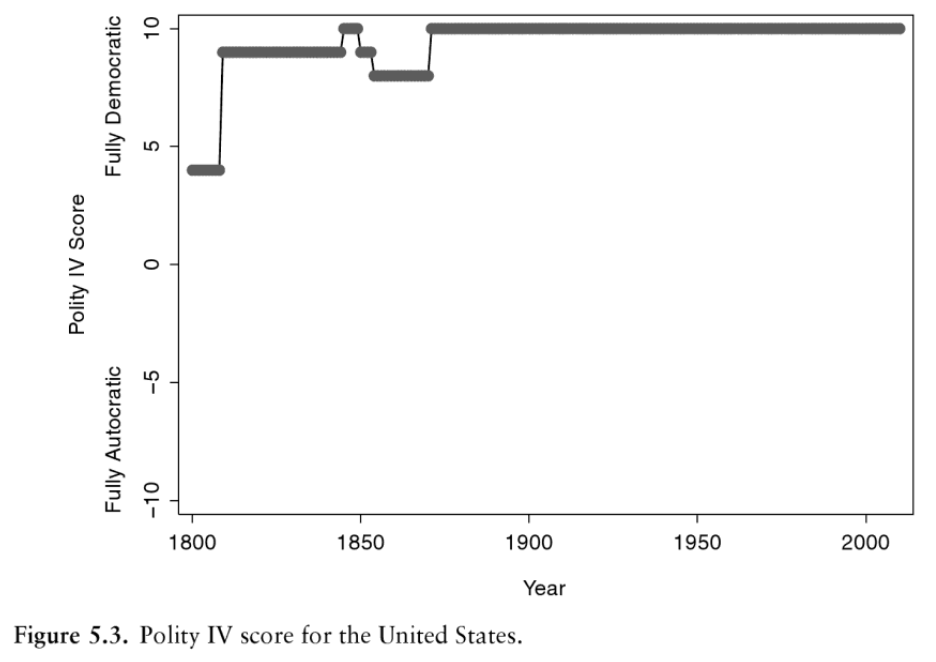
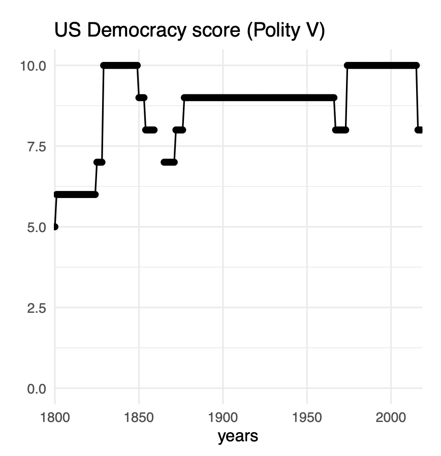
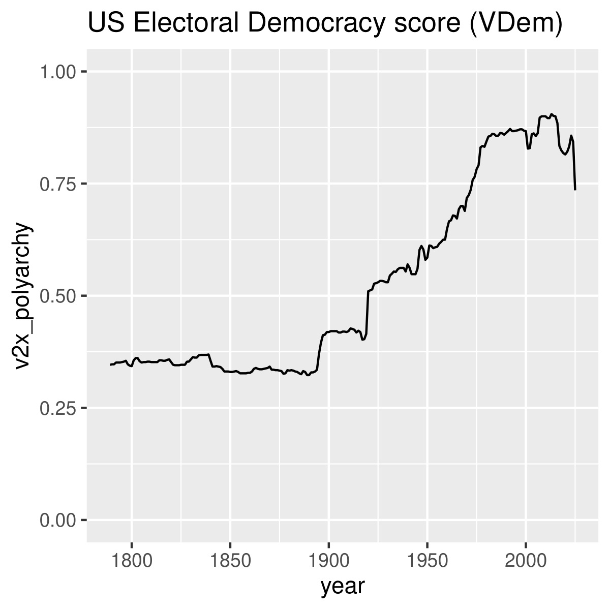
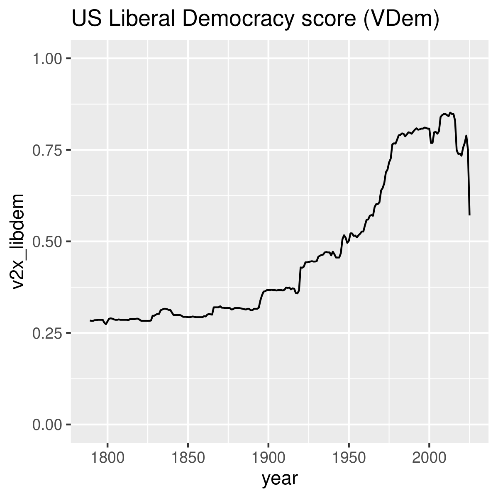
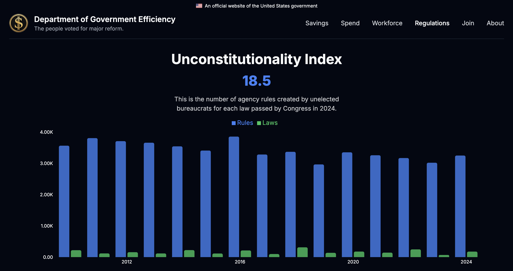

## Reading Prompt

What is an example of a classification system that forces people to classify themselves inappropriately? What is a possible negative consequence of this circumstance?

::: {.notes}
Speaker notes go here.
:::

---

## Announcements

- **Today:** Concept measurement ("operationalizing" variables of interest)
- **Thursday:** 
  - Intro to coding in R / RStudio; uploading your dataset in R
  - Theory writing workshop
  - Recommended: **Bring your laptop**

::: {.notes}
Speaker notes go here.
:::

---

## Lecture objectives

::: {.incremental}
- Gain tools for evaluating concept measurement
- Consider multiple approaches to measuring the same concept
- Apply the Data Feminism framework to understanding surveys
- Consider the strengths and limitations of your own survey measure
:::

::: {.notes}
Speaker notes go here.
:::

---

# Measuring concepts as variables {background-color="#2c3e50"}

::: {style="color: #ffffff;"}
Kellstedt & Whitten, *Fundamentals*, Ch. 5, "Measuring Concepts of Interest" [@kellstedt2022fundamentals]
:::

<!-- ============================================================
     CONVERTED from 8_concept_measurement.pptx (all slides).
     slide 1 -> merged into "## Announcements" above; slide 2 (title) dropped;
     slide 3 -> merged into the section divider above.
     ============================================================ -->

---

## In-class excercise

- What is your [concept of interest]{.hl}?
- What are 2-3 different ways to measure this concept?
- Which do you think is the best and why? 

---

## Theories and concepts

<!--## Recall: {style="font-size: 0.9em;"} -->

::: {.incremental}
- A **theory** is "conjecture" (a hunch) about the possible causal relationship between two or more concepts.
  - E.g., [Why]{.hl} you think that your IV causes/influences/shapes your DV.
  - Thursday!
- **Operationalization:** the movement of variables from the abstract conceptual level to the real, measured level.
  - E.g., How you [measure]{.hl} your abstract concept of interest.
  
<!-- - A **hypothesis** is an explicit statement (prediction) about what we would expect to observe if our theory is correct. It states an expected relationship between a *measure* of the independent variable and a *measure* of the dependent variable. -->

- **Example:** Is there a relationship between presidential votes (2020) and COVID behavior? 
  - How would you [operationalize]{.hl} this question?
:::

---

## Operationalizing "vote share" and "COVID behavior"

::: {.columns}
::: {.column width="50%"}
::: {.fragment}
{style="max-height: 52vh; width: auto;"}
:::
:::

::: {.column width="50%"}
::: {.fragment}
{style="max-height: 52vh; width: auto;"}
:::
:::
:::

. . .

::: {style="font-size: 0.6em; color: #666;"}
Source: @nyt2021covid
:::

---

## Today: {style="font-size: 0.9em;"}

::: {.columns}
::: {.column width="58%"}
::: {.incremental}
- How well does a variable's **operationalization** capture the underlying concept of interest? What is missing or over-emphasized?
- Who might be excluded or rendered invisible by how a concept is **operationalized?**
- What are the strengths and (inevitable) limitations to how your concepts of interest are **operationalized**?
- But first: how hard is it actually to *define* and *measure* something???
  - *The Art of Statistics*, pp. 7–10 [@spiegelhalter2019art]
:::
:::

::: {.column width="42%"}
::: {.fragment}
{style="max-height: 60vh; width: auto;"}
:::
:::
:::

# Measuring Democracy: A case study in content validity {background-color="#2c3e50"}

---

## Ex: measuring democracy {style="font-size: 0.85em;"}

. . .

**Define democracy:**

::: {.incremental}
- Binary (0 = not democracy; 1 = democracy) or scale?
- What components should it include?
  - Competitive elections
  - Near-universal participation among the adult population [@dahl1971polyarchy]
  - Anything else?
- **Polity IV measure** (−10 = strongly autocratic; 10 = strongly democratic) [@marshall2020polity]
- **Look at the US Polity score over time…**
:::

---

## Polity IV score {style="font-size: 0.8em;"}

::: {.columns}
::: {.column width="48%"}
{style="max-height: 55vh; width: auto;"}

::: {style="font-size: 0.7em; color: #666;"}
Figure 5.3, "Polity IV score for the United States" [@kellstedt2022fundamentals]
:::
:::

::: {.column width="52%"}
::: {.incremental}
- Has the United States' level of democracy been constant since before 1900?
- Democracy: competitive elections, near-universal participation in elections.
- Who is excluded?
  - African Americans (1868)
  - Women (1919/1920)
  - Voting Rights Act (1965)
  - Voter suppression
  - Incarcerated adults
  - Non-citizens
- Is the Polity IV measure valid?
- **Lacks content validity.**
:::
:::
:::

---

## Polity V score

::: {.columns}
::: {.column width="50%"}
Updated **Polity V** score suggests a little more variation in the US democracy score, but still appears not to take critical aspects into account.
:::

::: {.column width="50%"}
{style="max-height: 58vh; width: auto;"}

::: {style="font-size: 0.6em; color: #666;"}
Source: @marshall2020polity
:::
:::
:::

---

## Varieties in Democracy (V-Dem) {style="font-size: 0.8em;"}

::: {.columns}
::: {.column width="45%"}
{style="max-height: 55vh; width: auto;"}

::: {style="font-size: 0.55em; color: #666;"}
Source: @vdem2024
:::
:::

::: {.column width="55%"}
> "The **electoral principle of democracy** seeks to embody the core value of making rulers responsive to citizens, achieved through electoral competition for the electorate's approval under circumstances when suffrage is extensive; political and civil society organizations can operate freely; elections are clean and not marred by fraud or systematic irregularities; and elections affect the composition of the chief executive of the country. In between elections, there is **freedom of expression** and an **independent media** capable of presenting alternative views on matters of political relevance." [@vdem2024]
:::
:::

---

## Varieties in Democracy (V-Dem) {style="font-size: 0.8em;"}

::: {.columns}
::: {.column width="55%"}
> "The **liberal principle of democracy** emphasizes the importance of protecting individual and minority rights against the tyranny of the state and the tyranny of the majority. The liberal model takes a 'negative' view of political power insofar as it judges the quality of democracy by the limits placed on government. This is achieved by constitutionally protected **civil liberties**, strong **rule of law**, an **independent judiciary**, and effective **checks and balances** that, together, limit the exercise of executive power. To make this a measure of liberal democracy, the index also takes the level of electoral democracy into account." [@vdem2024]
:::

::: {.column width="45%"}
{style="max-height: 55vh; width: auto;"}

::: {style="font-size: 0.55em; color: #666;"}
Source: @vdem2024
:::
:::
:::

---

## Varieties in Democracy (V-Dem)

::: {.columns}
::: {.column width="50%"}
{style="max-height: 58vh; width: auto;"}
:::

::: {.column width="50%"}
{style="max-height: 58vh; width: auto;"}
:::
:::

::: {style="font-size: 0.55em; color: #666; text-align: center;"}
Source: @vdem2024
:::

---

## Ex: measuring democracy {style="font-size: 0.85em;"}

**In short:** different approaches to measuring democracy provide very different stories about the level of democracy in a given country (here, the United States) at a given year and/or over time.

::: {.columns}
::: {.column width="25%"}
{style="max-height: 34vh; width: auto;"}
:::

::: {.column width="25%"}
{style="max-height: 34vh; width: auto;"}
:::

::: {.column width="25%"}
{style="max-height: 34vh; width: auto;"}
:::

::: {.column width="25%"}
{style="max-height: 34vh; width: auto;"}
:::
:::

::: {style="font-size: 0.55em; color: #666; text-align: center;"}
Polity IV/V [@kellstedt2022fundamentals; @marshall2020polity] and V-Dem electoral/liberal democracy [@vdem2024] — same country, very different stories.
:::

## Standards for evaluating concept operationalization {style="font-size: 0.8em;"}

::: {.columns}
::: {.column width="33%"}
::: {style="text-align: left;"}
[CONCEPTUAL CLARITY]{.hl}
:::
:::

::: {.column width="33%"}
::: {style="text-align: center;"}
**RELIABILITY**
:::
:::

::: {.column width="33%"}
::: {style="text-align: right;"}
**VALIDITY**
:::
:::
:::

. . .

[CONCEPTUAL CLARITY]{.hl}: represents a clear sense of what the concept is that we are trying to measure. (Ex: measure income?)

---

<!--
## Measurement in the wild: an "index"

{style="max-height: 60vh; width: auto;" fig-align="center"}

::: {style="font-size: 0.6em; color: #666;"}
Source: @doge2025regulations
:::

---

## Exercise to turn in:

::: {.incremental}
- Name
- Jot down your **DV concept of interest**.
- Jot down how you are **operationalizing** your concept of interest (ANES, WVS).
:::

---

## Exercise to turn in:

- Name
- Jot down your **DV concept of interest**.
- Jot down how you are **operationalizing** your concept of interest (ANES, WVS).

. . .

- Does this measure have **conceptual clarity**? Why / why not?

---
-->

## Standards for evaluating concept operationalization {style="font-size: 0.8em;"}

::: {.columns}
::: {.column width="33%"}
::: {style="text-align: left;"}
**CONCEPTUAL CLARITY**
:::
:::

::: {.column width="33%"}
::: {style="text-align: center;"}
[RELIABILITY]{.hl}
:::
:::

::: {.column width="33%"}
::: {style="text-align: right;"}
**VALIDITY**
:::
:::
:::

. . .

[RELIABILITY]{.hl}: a measure that is repeatable or consistent — applying the same measurement rules to the same case/observation will produce identical results.

:::{.incremental}
- **Measurement bias:** systematic over-reporting or under-reporting of values for a variable.
- For scientific inquiry having a **reliable** measure is often more important than having an **unbiased** measure. Why? 
  - Since we are looking for general, *relative* patterns between variables: "If the measurement of X was biased upward, the same general pattern of association with Y would be visible. But if the measurement of X was unreliable, it would obscure the underlying relationship between X and Y" (KW 114).
:::

---

## Reliable v. unbiased measures {style="font-size: 0.85em;"}

::: {.columns}
::: {.column width="52%"}
::: {.incremental}
- What would this correlation look like if the NYT's measure of vote share or vaccination rate was **unreliable**?
- What would this correlation look like if the NYT's measure of vaccination rates was **reliable but biased** — i.e., systematically under-reported in the same way?
:::
:::

::: {.column width="48%"}
{style="max-height: 58vh; width: auto;"}
:::
:::

---

## Standards for evaluating concept operationalization {style="font-size: 0.85em;"}

::: {.columns}
::: {.column width="33%"}
::: {style="text-align: left;"}
**CONCEPTUAL CLARITY**
:::
:::

::: {.column width="33%"}
::: {style="text-align: center;"}
**RELIABILITY**
:::
:::

::: {.column width="33%"}
::: {style="text-align: right;"}
[VALIDITY]{.hl}
:::
:::
:::

. . .

[VALIDITY]{.hl}: a measure that accurately represents the substantive concept it is intended to measure.

:::{.incremental}
  - Whether or not the measure *appears* to be measuring what it purports to measure (an invalid measure captures something other than what is intended). *(face validity)*
  - The degree to which a measure contains all of the critical elements that, as a group, define the concept we wish to measure. *(content validity)*
- [Human judgements]{.hl} shape how we operationalize our concepts...
:::

---

## EX from <a href="https://www.afrobarometer.org/" target="_blank" style="color: inherit;">AfroBarometer</a> {.smaller}

:::: {layout="[65, 35]"}

::: {#first-column}

**Would you like having people from this group as neighbors?**

- People from a different region
- People from other ethnic groups
- LGB people
- Immigrants or foreign workers
- People who support a different political party

:::

::: {#second-column}

**Response Options:**

1. Strongly dislike
2. Somewhat dislike
3. Would not care
4. Somewhat like
5. Strongly like
6. DK/Refuse

:::

::::

::: {style="text-align: center; margin: -0.6em 0 0.2em 0; color: #107895; font-weight: bold; font-size: 1.15em;"}
What answer indicates the greatest degree of tolerance?
:::

<!--
::: {.incremental}
- Who is excluded? What are we measuring?
- Does language matter? Are people being honest?
- Did people make mistakes? Who is gathering the data, and why?
:::
-->

::: {.notes}
Speaker notes go here.
:::

---

## Exercise to turn in: {style="font-size: 0.9em;"}

- Name
- Jot down your **DV concept of interest**.
- Jot down how you are **operationalizing** your concept of interest (ANES, WVS).
- Does this measure have **conceptual clarity**? Why / why not?
- Do you expect this measure to be **reliable**? Why / why not?
- Does this measure seem to have **validity**? Why / why not?

# When measuring our concepts reinforces unearned power

---

## Human judgment in concept operationalization can reinforce power {style="font-size: 0.8em;"}

**Problem:**

::: {.incremental}
- Datasets *should* reflect the population they purport to represent.
- Data-gathering techniques can *instead* reflect systems of oppression that become naturalized as "the way things are" (@dignazio2020data [p. 104]).
- Open-source big datasets → little information about how / why those datasets were collected.
- Ex: classification systems can force people to classify themselves inappropriately.
:::

---

## Human judgment in concept operationalization can reinforce power {style="font-size: 0.8em;"}

**Result:**

::: {.incremental}
- Exclude some people and leave others misrepresented, uncounted, invisible, or lumped together as a "single story."
- Ex: in a survey of eligible US voters:
  - Examples of *excluded* populations?
  - Examples of surveyed people who remain *uncounted / invisible*?
:::

---

## Human judgment in concept operationalization can reinforce power {style="font-size: 0.8em;"}

**Consequences** of forcing survey respondents to classify themselves inappropriately?

::: {.incremental}
- Personal distress
- Erase identities; hide widespread collective oppression
- Influence allocation of resources and policy decisions
- Reinforce (false) ideas that socially constructed categories are natural
:::

---

## Human judgment in concept operationalization can reinforce power {style="font-size: 0.8em;"}

**Paradox of exposure:**

---

## Human judgment in concept operationalization can reinforce power {style="font-size: 0.8em;"}

**Paradox of exposure:** when those groups who could benefit from being counted also face potential harm or dangers in being counted.

::: {.fragment}
{style="max-height: 26vh; width: auto;"}
:::

::: {.fragment}
{style="max-height: 26vh; width: auto;"}
:::

---

## Human judgment in concept operationalization can reinforce power {style="font-size: 0.8em;"}

**Paradox of exposure:** when those groups who could benefit from being counted also face potential harm or dangers in being counted.

{style="max-height: 44vh; width: auto;"}

::: {style="font-size: 0.55em; color: #666;"}
@dignazio2020data [p. 158]. Courtesy of Patrick Torphy, Michaela Halnon, and Jillian Meehan, 2016.
:::

---

## Human judgment in concept operationalization can reinforce power {style="font-size: 0.8em;"}

**Solution?**

::: {.incremental}
- The person evaluating that knowledge / dataset **[you!]** should consider the *context* under which the data was created, to avoid:
  - reaching factually wrong conclusions
  - causing harm, reinforcing an unjust status quo
:::

. . . 

**Ask yourself:**

::: {.incremental}
- Which **power imbalances** led to silences in the dataset or missing data?
- Who has **conflicts of interest** that prevent transparency about the data?
- **Whose knowledge** about an issue has been marginalized?
- Ex: in a survey of eligible US voters — what *information* do you need in order to understand how your dataset was collected?
:::

<!-- ============================================================
     Placeholder retained from the original skeleton.
     ============================================================ -->

---

## For Thursday:

**Thu 9/17 — Introduction to R**

*Assigned tasks:*

- Download **R** and **RStudio** using [swirl](https://swirlstats.com/students.htm)'s step-by-step prompts
- Download (from Canvas) the dataset you will use — the file ends in `.csv`

Full schedule: <https://skdreier.github.io/POLS2140/>

::: {.notes}
Speaker notes go here.
:::

---

## TL;DR {.smaller}

- **Operationalization** moves a concept from the abstract to a concrete, measured variable — and every measure is imperfect.
- Judge a measure by three standards: **conceptual clarity**, **reliability** (repeatable/consistent — matters more than bias for spotting real X–Y relationships, KW 114), and **validity** (captures the intended concept — including *face* and *content* validity).
- Real survey items show how hard this is in practice: AfroBarometer's tolerance question buries "would not care" as option 3 of 6 — genuinely ambiguous between tolerance and indifference, a live validity/reliability problem, not just a textbook one.
- Measuring **democracy** shows the same stakes at scale: Polity IV/V and V-Dem tell very different stories about the same country because each includes different components (content validity).
- **Data Feminism:** measurement choices reinforce power — who is excluded, miscounted, or forced into ill-fitting categories; the **paradox of exposure**. Ask what power imbalances, conflicts of interest, and marginalized knowledge shaped any dataset you evaluate — including your own.

---

## References {.smaller}

::: {#refs}
:::
